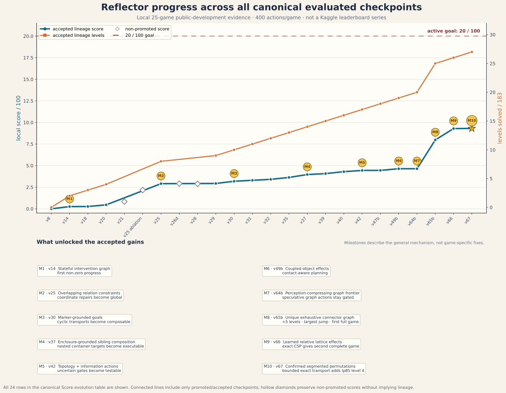

# Reflector real-games scorecard

Last updated: 2026-07-30
Canonical report: this is the only root-level report for real ARC-AGI-3 games.

## Result at a glance

> **Reflector has fully beaten 3 of 25 public-development games.**
> It has solved 39 of 183 levels across 13 games. The suite ran all 25 games,
> but evaluation coverage is not game completion.

| Outcome metric | Accepted v74 result | Meaning |
| --- | ---: | --- |
| Complete games beaten | **3 / 25** | `sb26`, `ft09`, and `cd82` were solved through their final levels. |
| Games with progress | **13 / 25** | At least one level was solved in thirteen games. |
| Levels solved | **39 / 183** | Eight in `sb26`; six each in `ft09`, `cd82`, and `lp85`; four in `tr87`; two in `ar25`; one each in `g50t`, `lf52`, `m0r0`, `r11l`, `sp80`, `tn36`, and `vc33`. |
| Official local score | **16.3554480981 / 100** | About **16.36%** of the 100-point scale on the known public-development games. |
| Evaluation coverage | **25 / 25 games** | Every public-development game was run. |
| Actions used | **9,185** | The budget was 400 actions per game; completed `sb26`, `ft09`, and `cd82` stopped after 124, 162, and 99 actions. |
| Kaggle submissions | **1 pending** | Submission `55113224` remains `PENDING`; no hidden score has returned yet. |

The current process-isolated result is
[`reports/official-isolated-v82f-dihedral-bridge-400.json`](reports/official-isolated-v82f-dihedral-bridge-400.json),
SHA-256
`a29e963af1dd3af31d6e7cf040b8d28e7006e9bbf1e5007ed02e32e714674f56`.
It identifies frozen source commit
`79a872ca0ed3fa40a98b185b3217e304d81dc68f`, candidate
`candidate-40b2dad207199755`, and inference fingerprint
`7c28b2a24674941f30a8053326fc2b9b6c2decea339cb8f3c57ff53ef54f7008`.

## Evaluation surfaces

| Evaluation surface | Agent | Score | Outcome | Status |
| --- | --- | ---: | --- | --- |
| Process-isolated official local suite | v82f accepted | **16.3554480981 / 100** | 3 games beaten; 39/183 levels across 13 games; 9,185 actions | exact v74 preservation outside `tr87`; 25/25 coverage |
| Target-only `tr87` reruns | v82f accepted | 47.6190476190 for one game | 4/6 levels; exact `[56,45,44,38,217,0]` twice | deterministic demonstrated-analogy gain |
| Target-only `re86` run | v84 experimental | 1.6243752403 for one game | 1/8 levels at `[34,366,0,0,0,0,0,0]`; four moves and one switch grounded, zero conflicts | target gain once; broader level-2 shape embedding under development |
| Target-only `sc25` run | v83 rejected | 0.0000000000 for one game | 0/6 levels in 400 actions despite operative distance-decreasing track replay | rejected; track endpoint was not the task goal |
| Clean process-isolated official local suite | v74 accepted | **14.4506861933 / 100** | 3 games beaten; 35/183 levels across 12 games; 9,185 actions | exact clean restart; 25/25 coverage |
| Read-only v75 representation audit | action-conditioned translation algebra, inactive | — | prospective authority on 13/25 games; same-episode inverse pairs on 7/25 | architecture evidence only; no task score |
| Process-isolated official local suite | v69 historical | **10.2554480981 / 100** | 2 games beaten; 30/183 levels across 12 games; 9,486 actions | superseded by v74 |
| Process-isolated twelve-game gate | v69 accepted | 21.3655168710 / 100 | 30 levels; every non-`cd82` accepted trajectory preserved, while `cd82` added levels 1–2 at `[12,6,382,0,0,0]` | passed |
| Target-only `cd82` reruns | v69 accepted | 14.2857142857 for one game | 2/6 levels; exact `[12,6,382,0,0,0]` twice after source freeze | deterministic gain twice |
| Target-only live offspring | secondary edge-stencil, safety-hardened and not promoted | 100.0000000000 for `cd82` | 6/6 levels in 99 actions; per-level authority revalidation; 0 conflicts and 0 causal-validation failures | target passed once; second repeat and preservation pending |
| Target-only live offspring | factored-orbit transport, safety review hold | 38.7914456145 for `lp85` | 6/8 levels; exact `[37,8,54,71,50,21,159,0]` three times, including the browser-paced recording | target gain reproduced; controller-alias, cover-bound, and interface-identification fixes required before promotion |
| Process-isolated official local suite | v68 historical accepted | **9.6840195267 / 100** | 2 games beaten; 28/183 levels; 9,486 actions | superseded by v69 |
| Process-isolated eleven-game gate | v68 accepted | 22.0091352879 / 100 | 28 levels; every non-`lp85` v67 score, level, action total, and completed-level action vector preserved exactly | passed |
| Target-only `lp85` reruns | v68 accepted | 19.6247789478 for one game | 5/8 levels; exact `[37,8,54,71,50,180,0,0]` twice | deterministic gain twice |
| Kaggle notebook artifact | v68 accepted package | — | exact export, both network-disabled smoke paths, and technical prize audit pass | not submitted |
| Process-isolated official local suite | v67 historical accepted | **9.3104639711 / 100** | 2 games beaten; 27/183 levels; 9,486 actions | superseded by v68 |
| Process-isolated eleven-game gate | v67 historical accepted | 21.1601453889 / 100 | 27 levels; every non-`lp85` v66 score, level, action total, and completed-level action vector preserved exactly | passed |
| Target-only `lp85` reruns | v67 historical accepted | 10.2858900589 for one game | 4/8 levels; exact `[37,8,54,71,230,0,0,0]` twice | deterministic gain twice |
| Kaggle notebook artifact | v67 historical accepted package | — | exact export, both offline smoke paths, and technical prize audit pass | not submitted |
| Process-isolated official local suite | v66 historical accepted | **9.2878934935 / 100** | 2 games beaten; 26/183 levels; 9,486 actions | superseded by v67 |
| Process-isolated eleven-game gate | v66 historical accepted | 21.1088488488 / 100 | 26 levels; every non-`ft09` v65b score, level, action total, and completed-level action vector preserved exactly | passed |
| Target-only `ft09` reruns | v66 historical accepted | 99.0037508892 for one game | 6/6 levels in 162 actions; exact `[4,7,14,16,94,27]` twice | deterministic gain twice |
| Process-isolated official local suite | v65b historical accepted | **7.9736077792 / 100** | 1 game beaten; 25/183 levels; 9,724 actions | superseded by v66 |
| Process-isolated eleven-game gate | v65b historical accepted | 18.1218358618 / 100 | 25 levels; every non-`sb26` v64b score, level, action total, and completed-level action vector preserved exactly | passed |
| Target-only `sb26` reruns | v65b historical accepted | 100.0000000000 for one game | 8/8 levels in 124 actions; exact `[9,15,15,15,17,19,17,17]` twice | deterministic gain twice |
| Process-isolated official local suite | v64b historical accepted | **4.6402744459 / 100** | 0 games beaten; 20/183 levels | superseded by v65b |
| Process-isolated eleven-game gate | v64b historical accepted | 10.5460782860 / 100 | 20 levels; every v49b completed-level action vector preserved; `vc33` added | passed |
| Paired target/preservation reruns | v64b historical accepted | 0.1221400128 across `tn36`, `vc33` | exact `[tn36:123,277; vc33:262,138]` twice; expansion gate off/on respectively | deterministic twice |
| Process-isolated official local suite | v49b historical accepted | **4.6401724704 / 100** | 0 games beaten; 19/183 levels | superseded by v64b |
| Process-isolated ten-game gate | v49b accepted | 11.6004311761 / 100 | 19 levels; every v47b level and action count preserved | exact twice |
| Target-only `m0r0` reruns | v49b accepted | 4.7619047619 for one game | 1/6 levels; `[20, 380]` under 400 actions | deterministic gain twice |
| Recording-enabled level-2 audit | v49b accepted | 4.7619047619 for one game | 1/6 `m0r0` levels; five repeated 12-action false-edge loops | exact accepted result reproduced; v50 diagnosis |
| Target-only symbolic offspring | v50 confirmed contextual pair transitions | 4.7619047619 for one game | 1/6 `m0r0` levels; two exact edges confirmed, third family member exposed | task and one-edge predictions falsified; rejected |
| Target-only symbolic offspring | v51 induced convergent transport family | 4.7619047619 for one game | 1/6 `m0r0` levels; family prediction passed, task prediction failed | rejected; post-family plan was cut off by base cap |
| Target-only symbolic offspring | v52 one post-accommodation plan | 4.7619047619 for one game | 1/6 `m0r0` levels; `[20, 380]`; allowance 19, effective cap 83 | rejected; extra grounded planning did not supply the missing goal/phase model |
| Three-way terminal-relation development round | v55 contact-only / shortest-grounded / marker-first | 4.7619047619 each for `m0r0` | all remained 1/6 at `[20, 380]`; relation variants each logged 54 distance confirmations and 5 terminal-step falsifications per retry | rejected; sparse marker coverage was a predictable transport trigger, not a terminal goal |
| Target-binding accommodation | v55a marker-first with exact target retirement | 4.7619047619 for `m0r0` | 1/6 at `[20, 380]`; retired one falsified target and generated a distinct 11-step assignment | rejected; the alternative route crossed the known transport trigger because goal search did not consume contextual transitions |
| Four-way goal/transition recombination | v55b exact-off / contextual-contact / contextual-marker / transport-marker | 4.7619047619 each for `m0r0` | all 1/6 at `[20, 380]`; contextual-marker confirmed 2 edges, used them in 90 successor evaluations, and retired 3 targets; transport variant induced its family | rejected; operative composition and target variation still lacked a multi-phase goal procedure |
| Four-way paired-procedure population | v56 exact-off / repeat-entry / reuse-progress / canonical-probe | 4.7619047619 each for `m0r0` | all 1/6 at `[20, 380]`; all procedure variants logged 0 proposals, confirmations, macros, and planner uses | rejected; direct recording parse showed the pair never disappeared, so the offspring targeted a nonexistent event and supplied no procedure evidence |
| Four-way repeated-form event population | v57 exact-off / confirm-affordance / confirm-discontinuity / phase-segment | 6.6465283447 / 2.0789128897 / 0.2931986040 / 6.6465283447 across `lp85`, `g50t` | control and phase: 4 levels; affordance: 2; discontinuity: 1; confirmation modes issued 143 / 359 event-confirmation actions | rejected; API action-ID conflation pooled distinct coordinate clicks, and immediate confirmations recursively scheduled more confirmations |
| Four-way role-grounded event population | v57a exact-off / confirm-affordance / confirm-discontinuity / phase-segment | 6.6465283447 / 4.0072549883 / 0.3302558292 / 6.6465283447 across `lp85`, `g50t` | control and phase: 4 levels; affordance: 4 with `lp85` L2 slowed 8→85; discontinuity: 2; phase detector operative without trajectory change | rejected; exact replay can undo useful toggles, while phase suffixes duplicate already distinct raw frame states |
| Three-way parameterized affordance population | v58 exact-off / phase-segment / propagate-affordance | 6.6465283447 each across `lp85`, `g50t` | all preserved 4 levels; propagation fired four times and changed `lp85` actions from `[37,8,54,301]` to `[37,10,54,299]` | rejected; no score/level gain and each varied action recursively scheduled another variation |
| Three-way noncascading affordance population | v58a exact-off / phase-segment / propagate-affordance | 6.6465283447 each across `lp85`, `g50t` | all preserved 4 levels; two role variations remained and `lp85` stayed `[37,10,54,299]` versus control `[37,8,54,301]` | rejected; role variation still preempted the operative cyclic-alignment scheme |
| Three-way deferred affordance population | v58b exact-off / phase-segment / propagate-affordance | 6.6465283447 each across `lp85`, `g50t` | all exactly `[g50t:27,373; lp85:37,8,54,301]`; propagation recorded 62 maximum in-level detections but selected 0 variations | rejected; safe but behaviorally inert under absolute grounded-advisor priority |
| Three-way disequilibrium-gated reflection population | v59 exact-off / phase-segment / propagate-affordance | 6.6465283447 each across `lp85`, `g50t` | all exactly matched control; three pending `lp85` affordances arose before disequilibrium and zero variations were selected | rejected; the working scheme advanced before the threshold, and no event supported the genuinely stalled level |
| Five-game cultural inheritance control | v60 exact-off / predictive common-sense v1 | 8.6109922903 each across `ar25`, `g50t`, `lp85`, `m0r0`, `sb26` | both solved the same 10 levels with identical action vectors; v60 carried one definition and selected it 0 times | cultural transport accepted, task promotion withheld; exact definition/evidence/common-sense roots exported and smoke-tested |
| Five-game first-contact probe | v61 deterministic frame center | 14.4856728742 across `bp35`, `cn04`, `ft09`, `lf52`, `m0r0` | same 7 levels as v49b; delayed three accepted first completions by one action | rejected; ungrounded first contact added no task progress |
| Target-only deep productive reuse | v62 64-trial failed-retry cap | 0.0000000000 for `sp80` | 0/6 levels; 28 productive-role selections versus accepted level 1 at action 196 | rejected; repetition regressed an accepted completion |
| Target-only compact object graph | v64 ungated compact-component frontier | 0.0025493852 for `vc33` | 1/7 levels at action 262 with `[262,138]`, exact twice | target passed; promotion withheld pending preservation |
| Eleven-game compact object-graph gate | v64 ungated compact-component frontier | 10.5241027733 across accepted progress games plus `vc33` | added `vc33` but lost `tn36`; 19 total levels remained | rejected; a deterministic gain cannot offset any accepted completion regression |
| Target-only inheritance substrate | v53 content-addressed starter schemes | 4.7619047619 for one game | 1/6 `r11l` levels; `[18, 382]`; correct six-definition library root | rejected; inherited components were not credited because structural preregistration remained disabled |
| Target-only inheritance substrate | v53a operative content-addressed schemes | 4.7619047619 for one game | 1/6 `r11l` levels; `[18, 382]`; three inherited hashes in 390 assessments | infrastructure passed; no task gain, not promoted |
| Three-offspring inheritance development round | v54 smallest / rarest / largest relative object ranks | 4.7619047619 / 1.8814382896 / 0.0000000000 for `r11l` | level 1 at action 16 / 35 / no level | invalidated for promotion: two offspring renewed the 24-trial cap across same-level retries |
| Three-offspring inheritance development round | v54a nonrenewable relative ranks | 4.7619047619 / 1.8814382896 / 0.0000000000 for `r11l` | level 1 at action 16 / 35 / no level; per-level cap held | smallest and rarest advanced; largest rejected |
| Two-offspring inheritance held-out round | v54a smallest / rarest relative ranks | 0.0805768801 each across `s5i5`, `tn36`, `vc33` | both exactly matched v49b: 0 / level 1 at action 123 / 0 | rejected: no held-out gain; post-cap evidence attribution leak found |
| Process-isolated official local suite | v47b accepted | **4.4496962800 / 100** | 0 games beaten; 18/183 levels | 25/25 coverage |
| Process-isolated nine-game gate | v47b accepted | 12.3602674444 / 100 | 18 levels; every v42 level preserved | exact twice |
| Target-only `sp80` reruns | v47b accepted | 0.1885375141 for one game | 1/6 levels; `[196, 204]` under 400 actions | deterministic gain twice |
| Process-isolated official local suite | v42 accepted | **4.4421547794 / 100** | 0 games beaten; 17/183 levels | 25/25 coverage |
| Process-isolated eight-game gate | v42 accepted | 13.8817336856 / 100 | 17/60 levels; every v40 action count preserved | exact twice |
| Target-only `g50t` reruns | v42 accepted | 3.5714285714 for one game | 1/7 levels; `[29, 11]` under 40 actions | deterministic gain twice |
| Process-isolated official local suite | v40 accepted | **4.2992976365 / 100** | 0 games beaten; 16/183 levels | 25/25 coverage |
| Research symbolic control, same local suite and budget | object/frame graph frontier v1 | **0.0003283918 / 100** | 0 games beaten; 1/183 levels (`vc33`) | 25/25 coverage; not a candidate |
| Target-only research hybrid | local Gemma 4 E2B + symbolic scene summary | 0.0000000000 for one game | 0/7 `g50t` levels in 40 actions | not symbolic; not Kaggle-compatible; rejected |
| Target-only integrated hybrid | v43f symbolic core + impasse-gated local Gemma 4 E2B | 3.5714285714 for one game | 1/7 `g50t` levels; `[27, 53]` in 80 actions, exactly matching symbolic v43f | not symbolic; no gain; rejected |
| Target-only symbolic offspring | v44 action-family fairness | 0.0000000000 for one game | 0/6 `sp80` levels in 400 actions | fairness operative; productive reuse absent; rejected |
| Target-only symbolic offspring | v45 primitive-grounded family reuse | 0.0000000000 for one game | 0/6 `sp80` levels in 400 actions | primitives present but behavior identical to v44; rejected |
| Source-matched historical-genome audit | v28 genome on current source | 0.0000000000 for one game | 0/6 `sp80` levels in 400 actions versus historical one level | source drift isolated to later maturity gating |
| Target-only symbolic offspring | v46 cross-retry maturity | 0.0473757834 for one game | 1/6 `sp80` levels at action 391 | real progress, but rejected: reuse began after one failure and breached preregistration |
| Target-only symbolic offspring | v46b non-bypass cross-retry maturity | 0.0673228096 for one game | 1/6 `sp80` levels at action 328, exact twice | target passed; rejected after losing `lf52` and `lp85` in preservation |
| Target-only symbolic offspring | v47 failure-conditioned fairness | 0.1885375141 for one game | 1/6 `sp80` levels at action 196, exact twice | target passed; rejected after losing `lp85` in preservation |
| Five-game transfer audit | v47b accepted | 0.0000000000 across five games | 0/34 levels in 2,000 actions | fairness and bounded reuse operative; broad transfer falsified |
| Target-only symbolic offspring | v48 boundary translation normalization | 0.0000000000 for one game | 0/6 `m0r0` levels; 147 graph states | detector correctly stayed off on growing strip; rejected |
| Target-only symbolic offspring | v48b monotone boundary normalization | 0.0000000000 for one game | 0/6 `m0r0` levels; normalization activated, 89 graph states | state normalized but coordinate-token crowding remained; rejected |
| Target-only symbolic offspring | v48c nuisance-conditioned fairness | 0.0000000000 for one game | 0/6 `m0r0` levels; 156 complex actions, 81 graph states | family balance operative; missing joint operator; rejected |
| Target-only symbolic offspring | v49 paired-object contact planning | 3.7073652991 for one game | 1/6 `m0r0` levels at action 34 | real joint-plan progress; rejected for missing ≤30 action prediction |
| Target-only symbolic offspring | v49b latent paired contact | 4.7619047619 for one game | 1/6 `m0r0` levels at action 20, exact twice | promoted after exact preservation and full-suite gates |
| Target-only symbolic offspring | v41h committed trajectory | 0.0000000000 for one game | 0/7 `g50t` levels in 400 actions | falsified; not promoted |
| Source-matched process-isolated suite | v40 exact-off / v39 policy | 4.0770754143 / 100 | 0 games beaten; 15/183 levels | exact parent reproduction |
| Process-isolated seven-game gate | v40 accepted | 15.3546344162 / 100 | 16 levels in the seven affected games | every v39 action count preserved |
| Process-isolated seven-game gate | v40 exact-off / v39 policy | 14.5609836226 / 100 | 15 levels in the seven affected games | source-matched control |
| Target-only `ar25` reruns | v40 accepted | 8.3333333333 for one game | 2/8 levels; `[17, 17, 366]` | deterministic gain twice |
| Target-only `ar25` control | v40 exact-off / v39 policy | 2.7777777778 for one game | 1/8 levels; `[17, 383]` | source-matched control |
| Process-isolated official local suite | v39 accepted | **4.0770754143 / 100** | 0 games beaten; 15/183 levels | 25/25 coverage |
| Source-matched process-isolated suite | v39 exact-off / v37 policy | 3.9659643032 / 100 | 0 games beaten; 14/183 levels | exact parent reproduction |
| Process-isolated seven-game gate | v39 accepted | 14.5609836226 / 100 | 15 levels in the seven affected games | every v37 action count preserved |
| Process-isolated seven-game gate | v39 exact-off / v37 policy | 14.1641582258 / 100 | 14 levels in the seven affected games | source-matched control |
| Target-only `ar25` reruns | v39 accepted | 2.7777777778 for one game | 1/8 levels; `[17, 383]` | deterministic gain twice |
| Target-only `ar25` control | v39 exact-off / v37 policy | 0.0000000000 for one game | 0/8 levels; `[400]` | source-matched control |
| Process-isolated official local suite | v37 accepted | **3.9659643032 / 100** | 0 games beaten; 14/183 levels | 25/25 coverage |
| Source-matched process-isolated suite | v35 control | 3.6326309699 / 100 | 0 games beaten; 13/183 levels | exact parent reproduction |
| Official local public suite | v35 historical accepted | 3.6326309699 / 100 | 0 games beaten; 13/183 levels | superseded by v37 |
| Process-isolated six-game gate | v35 accepted | 15.1359623745 / 100 | 13 levels in the six affected games | all v32 action counts preserved |
| Process-isolated six-game gate | v32 control | 14.2100364486 / 100 | 12 levels in the six affected games | source-matched control |
| Target-only `sb26` reruns | v35 accepted | 8.3333333333 for one game | 2/8 levels; `[9, 15, 376]` | deterministic structure twice |
| Process-isolated official local suite | v32 historical accepted | **3.4104087477 / 100** | 0 games beaten; 12/183 levels | superseded by v35 |
| Source-matched process-isolated suite | v32 control / v31 genome | 3.2992976365 / 100 | 0 games beaten; 11/183 levels | exact parent reproduction |
| Process-isolated official local suite | v31 historical accepted | 3.2992976365 / 100 | 0 games beaten; 11/183 levels | superseded by v32 |
| Process-isolated official local suite | v28 object/flow offspring | 2.8820272500 / 100 | 0 games beaten; 9/183 levels | rejected: lost `tn36`, slowed two wins |
| Target-only `sb26` reruns | v38 connector relocation | 16.6666666667 for one game | 3/8 levels; `[9, 15, 15, 361]` | rejected: predicted 17-action program did not advance |
| Target-only `sb26` control | v38 exact-off / v37 policy | 16.6666666667 for one game | 3/8 levels; `[9, 15, 15, 361]` | source-matched control |
| Process-isolated official local suite | v26d experimental | 2.9202784571 / 100 | 0 games beaten; 8/183 levels | replay-only efficiency gain; not promoted |
| Source-matched isolated ablation | v25 without global constraints | 2.1693300953 / 100 | 7/183 levels | controlled comparison |
| Threaded shared-process suite | v25 invalidated run | 1.9584957457 / 100 | 6/183 levels | retained as methodological negative evidence |
| Kaggle public leaderboard | v65b, submission `55113224` | — | hidden rerun pending; no returned score | **pending** |
| Kaggle private leaderboard | — | — | no returned score | unavailable |
| Target-only `ft09` run | v22 experimental | 16.7556638306 for one game | 3/6 levels | not promoted |
| Target-only `ft09` run | v23 experimental | 47.6190476190 for one game | 4/6 levels; `[4, 7, 14, 16]` actions | deterministic twice; not promoted |
| Four-game accepted-win gate | v23 experimental | 13.5583130957 across four games | 7 levels; all v21 wins preserved | passed; not a 25-game score |
| Target-only `ft09` run | v25 experimental | 66.1466080321 for one game | 5/6 levels; `[4, 7, 14, 16, 94]` actions | deterministic twice |
| Four-game process-isolated gate | v25 accepted | 18.1902031989 across four games | 8 levels; all prior wins preserved | exact twice |
| Four-game process-isolated gate | v26d experimental | 18.2517403567 across four games | 8 levels; all prior wins preserved | exact twice |
| Target-only `ft09` run | v26e experimental | 66.3927566633 for one game | 5/6 levels; 2 composite trials | deterministic twice; no task gain |
| Target-only `ft09` run | v26f experimental | 66.3927566633 for one game | 5/6 levels; replay fell from 55 to 12 actions | deterministic twice; no task gain |

These surfaces must not be combined. The accepted local result uses 25 known
public-development games. Kaggle evaluates a separate hidden set of 110 games:
half determine the visible public score and half the private score. Submission
`55113224` has entered that evaluation boundary but remains pending, so it
does not yet provide hidden-score evidence.

### Pure symbolic graph control

To separate Reflector's constructive mechanisms from generic symbolic
exploration, a research-only graph-frontier control was run on the identical
25-game inventory with the identical 400-action-per-game budget. It proposes
simple actions and clicks on connected monochrome objects, reduces thin edge
strips, records an explicit frame-transition graph, and follows shortest known
paths to untested state-action frontiers. It contains no neural model, LLM,
game identifier, route, or training data.

The control scored **0.0003283918/100**, completed **1/183 levels** and **0/25
games**, and used all 10,000 actions. Its single `vc33` level reproduced at the
same score in a separate exact rerun. Across the suite it constructed **5,130
distinct frame states**, changed **9,185 recorded transition targets**, and
used only **203 frontier routes**. The result falsifies raw or lightly
normalized frame graphs as a sufficient 400-action solution. Animation,
autonomous dynamics, phase, and hidden commitment cause state explosion or
nonstationary edges before useful frontier return can dominate.

This does not prove that Reflector generalizes better on hidden games: v40 was
developed against the public suite, while this control was not. It does show,
on a paired local budget, that v40's object relations, learned action roles,
scheme transfer, and targeted structural solvers contribute far more than this
generic graph baseline. See the
[comparison protocol](references/SYMBOLIC_ARC3_COMPARISON.md), the
[full control report](reports/symbolic-object-graph-control-v1-400.json), and
the [exact `vc33` rerun](reports/symbolic-object-graph-control-v1-vc33-rerun-400.json).

### Runtime-LLM probe and committed-trajectory offspring

A research-only offspring was allowed to consult the locally available
`google_gemma-4-E2B-it-Q4_K_M.gguf` model through `llama.cpp`. This was Gemma
4 E2B, not Gemma 3: no Gemma 3 weight was present. The model received a
symbolic connected-component summary, frame difference, recent action/effect
history, and grounded legal action candidates. On `g50t` it produced 40/40
parseable responses with no fallback, but solved **0/7 levels**. It chose
actions `{1: 25, 2: 4, 3: 5, 4: 6}`, never chose action 5, repeated generic
exploration claims despite accumulating evidence, and made five cases where
its stated action semantics disagreed with the candidate it selected. The run
is useful negative evidence: fluent verbal hypotheses did not provide grounded
causal credit. It is not symbolic, depends on an external model process, and
is not a Kaggle-compatible candidate.

The follow-up hybrid did not replace Reflector's controller. It retained the
symbolic perception, causal ledger, schemes, topology, and planner, and opened
a Gemma arbitration gate only after at least two evidenced trajectory-gate
failures or planner disablement. The selected hybrid action was installed as
the actual symbolic `Decision` before hypothesis priming and trace recording,
so subsequent structural credit was assigned to the action really taken.

On the same 80-action `g50t` target used for v43f, this integrated hybrid
completed level 1 in 27 actions and then spent 53 actions on level 2:
**1/7 levels**, exactly the v43f symbolic result. Gemma received 27
consultations, accepted the symbolic proposal 22 times, overrode it five
times, and returned six invalid responses that safely fell back. Its typed
action grounding was still unreliable: one response hypothesized `ACTION4`
while candidate index 4 denoted and selected action 5. Continuous arbitration
also cost roughly 5.5 minutes of CPU inference for no task gain. The evidence
supports a narrower future role—one bounded typed model-mutation proposal,
followed by symbolic execution and falsification—not an LLM vote on every
action after an impasse.

The symbolic v41 branch then learned four translation effects, a four-step
committed macro, autonomous replay, and contextual collision edges from
rendered interaction alone. Successive trace-driven repairs added bounded A*
detours, pause-tolerant replay, same-level accommodation across deaths,
independent first-step planning, synchronous replay-onset recognition, and
failure-driven variation of the committed axis. These changes were operative:
the final run validated all four replay steps and accumulated 21 blocked
state-action edges. Nevertheless every recorded v41 target run completed
**0/7 `g50t` levels in 400 actions**. V41h spent 45 actions under the causal
planner, then exhausted its bounded planning or found no plan; it reset three
times and ended `GAME_OVER`.

V41 is rejected under its preregistered falsifier, which required level 1
within 30 actions twice. Its failure supplied the disequilibrium for accepted
v42, but none of v41's zero-score variants is itself promoted. The earned
insight is narrower than success: hidden phase and replay can be represented
symbolically, but a list of point collisions plus local A* is not yet a
reusable topological world model, and accommodation must preserve structural
knowledge without preserving a failed control scheme.

Raw evidence:

- [Gemma hybrid probe](reports/experimental-gemma4-hybrid-g50t-40.json)
- [Gemma + symbolic impasse arbitration](reports/experimental-gemma-symbolic-g50t-r1-80.json)
- [v41 bounded-A* run](reports/experimental-v41c-g50t-astar-r1-400.json)
- [v41 asynchronous-replay run](reports/experimental-v41d-g50t-asynchronous-replay-r1-400.json)
- [v41 cross-life accommodation run](reports/experimental-v41e-g50t-cross-life-accommodation-r1-400.json)
- [v41 independent-replay run](reports/experimental-v41f-g50t-independent-replay-r1-400.json)
- [v41 replay-onset run](reports/experimental-v41g-g50t-synchronous-replay-onset-r1-400.json)
- [v41 scheme-variation run](reports/experimental-v41h-g50t-scheme-variation-r1-400.json)

### Reporting terms

- **Game beaten:** the agent completed every level in that game.
- **Game with progress:** the agent completed at least one level, but possibly
  not the whole game.
- **Level solved:** the environment reported advancement to the next level.
- **Evaluation coverage:** the game was run and returned a result. It says
  nothing about whether the agent solved it.
- **Local score:** Relative Human Action Efficiency averaged over the 25 local
  games, on the official 0–100 scale. Unsolved games contribute zero.
- **Kaggle score:** a score returned by an actual hidden Kaggle evaluation.
  Export and smoke-test success do not create a Kaggle score.

Official competition links:

- [Kaggle competition and scoring](https://www.kaggle.com/competitions/arc-prize-2026-arc-agi-3/data)
- [Kaggle public leaderboard](https://www.kaggle.com/competitions/arc-prize-2026-arc-agi-3/leaderboard)
- [ARC Prize competition requirements](https://arcprize.org/competitions/2026/arc-agi-3)

## V75 action-translation representation and live trace audit

V75 is not a task-performance candidate. Its opt-in, Kaggle-exportable kernel
discovers episode-local action-conditioned translations from rendered
interventions without yet influencing action choice. One transition may
propose a law; a later structurally
distinct source must confirm the preregistered displacement before authority.
Contextual no-ops preserve a collision hypothesis, contradictory nonzero
effects quarantine the action, ambiguity abstains, and every bound fails
closed.

The chronological audit over the clean v74 recordings found:

- at least one prospectively authoritative law on **13/25 games**;
- inverse action generators within the same episode on **7/25 games**;
- repeated complete four-direction algebras on `ls20` and `re86`;
- an inverse pair on `tu93`;
- only a partial algebra on `dc22`;
- no runtime control, score, or transfer claim.

The audit is
[`reports/v75-action-translation-audit-v1.json`](reports/v75-action-translation-audit-v1.json),
SHA-256
`f0e1295edf7071ef0ec00fde9dd3e2ac585e234e35b877db24144ce73b8b96c6`.
Its compressed input recordings have SHA-256
`0e052162bb96f8595414c31949d778eec828a48e7c78d7547ae859b44ccc3459`;
the corresponding cognitive streams have SHA-256
`8a6cb7cfc28283775f08d7d97767ef3b5980c39e24ca971369af97dd5a6d1854`.

Generation-35 trace-only offspring `candidate-7774a464a9ee9f95` then ran
process-isolated on `dc22`, `ls20`, `re86`, and `tu93`. All four 400-action
vectors were byte-for-byte identical to v74. Live cognition nevertheless
formed authority in every target; the terminal current-episode states formed
4, 1, 4, and 2 laws respectively, with inverse pairs on `dc22`, `re86`, and
`tu93`. The raw report is
[`reports/official-isolated-v75-action-translation-live-targets-400.json`](reports/official-isolated-v75-action-translation-live-targets-400.json),
SHA-256
`445526fef9c2d38ef5503c14d7091cc6adba3f5d103682bea71afa3882dd6119`.
Its recordings and cognition archives have SHA-256
`a722126f5f005c8c973431901c6563c1a5d772b7a879f6250c074ac8cddff800`
and
`98fbcba56a50a7f08a277ac0aff0e4bf4e975544651226ec1906520c65d2b300`.
The candidate SHA-256 is
`56449d3224ae92271a79703661240983a2d3cb327a7317a6af1e523205e558ac`.
The full suite passed with 409 tests and 3 skips; Ruff and mypy passed; exact
candidate export and both network-disabled smoke paths passed. Synthetic
controls cover absolute translation, recoloring, and rotational equivariance.

The next falsifiable step is a bounded relative-position quotient. It must
beat uniform probing or safely abstain on at least three games before it may
affect control. Task promotion still requires deterministic progress on two
structurally different games and exact preservation of v74.

## V76 rejected action-translation orbit probe

Generation-36 candidate `candidate-b584013b761549e7` made the v75 algebra
operative only after an inverse generator pair gained same-episode authority.
It traversed one generator in a bounded straight ray until contextual no-op,
conflict, progress, or a frame-derived cap, then selected the least-tested
inverse generator. It retained no game identity, fixed action mapping, goal,
coordinate, color, or route.

The preregistered four-game diagnostic falsified the task claim:

| Game | Probe selections | Completed rays | Levels before | Levels after |
| --- | ---: | ---: | ---: | ---: |
| `dc22` | 198 | 65 | 0 | 0 |
| `ls20` | 320 | 49 | 0 | 0 |
| `re86` | 305 | 53 | 0 | 0 |
| `tu93` | 8 | 7 | 0 | 0 |

The mechanism was strongly operative on three games and weakly operative on
the fourth, but it neither improved nor safely abstained. V76 is rejected,
and no preservation or full-suite run was warranted. The result report is
[`reports/official-isolated-v76-action-translation-orbit-targets-r1-400.json`](reports/official-isolated-v76-action-translation-orbit-targets-r1-400.json),
SHA-256
`0dfd4d42eeffe64547dcab50f3610a2a6890a828a802572566ae6a4ca98d00a3`.
The candidate, cognition, and recording SHA-256 values are respectively
`ef2e0a574abe1e43b1846372e12e45d1629dd36bb07b5f910b1767319b8201b5`,
`a43fb2a8d3f854afcf17f96a1414832c83a622dae61fc0acb21d290a1e3bf9ef`,
and
`80426ef67e9bdfb59889a9c9ce226944e553798e426e756e1683aba0b0dfa36b`.

## V77 rejected contact-affordance probe

Generation-37 candidate `candidate-f1554519f6c31f32` narrowed v76 to one ray
per authoritative generator per episode. After a prospectively predicted
translation no-op, it tried one least-used plain action outside the currently
authoritative generator set at each novel color-free relative contact
signature.

The four-game result remained zero levels everywhere. Probe telemetry was:

| Game | Ray selections | Contact selections | Contact abstentions |
| --- | ---: | ---: | ---: |
| `dc22` | 30 | 4 | 8 |
| `ls20` | 69 | 6 | 6 |
| `re86` | 235 | 16 | 0 |
| `tu93` | 4 | 3 | 0 |

V77 is rejected. Besides the null result, it exposed an identification flaw:
under a partial algebra, a not-yet-learned generator can be mistaken for a
non-generator affordance. The report is
[`reports/official-isolated-v77-translation-contact-targets-r1-400.json`](reports/official-isolated-v77-translation-contact-targets-r1-400.json),
SHA-256
`f2a4183246b6e43319f25df2f026d5ed861082819efde9ac1dc47c43b118672c`.
The candidate, cognition, and recording SHA-256 values are respectively
`3ec6617a8390bcbd8e4b949a00b281d90e2b53f8c5d7da92480594b0973fa7a8`,
`98485d83174e7909c4424b9b60527375f1df6a549f543146ef140844ae5056da`,
and
`31275e3743d06e1ef3c277f1493e250ed95a8056fc0d467f3acb5b7381e412db`.

## V78 positive action-effect typing

Generation-35 trace-only candidate `candidate-927ca35ac9ce29e2` returns to
accepted parent v74 rather than inheriting either rejected controller. It
prospectively types only positively rendered effects: relative translation,
component birth/death, component-form change, relative-layout change, or
residual render change. A no-op is contextual inapplicability and can never
license a type by complement. Multiple context-conditioned positive types may
coexist for one action.

The chronological clean-v74 audit found:

- at least one authoritative positive type on **17/25 games**;
- non-translation authority on **14/25 games**;
- relative translation on 16 games, component-form change on 12,
  relative-layout change on 4, and component birth/death on 3 each;
- action typing alone is not a control claim: several games assign the same
  type signature to every action.

The immutable audit is
[`reports/v78-action-effect-type-audit-v1.json`](reports/v78-action-effect-type-audit-v1.json),
SHA-256
`bcf11bd626142f65e22517b8b64ed2da1800c2f8a63dc4b615512170bcd132e2`.

A fresh-process live trace run covered `dc22`, `re86`, `tu93`, `g50t`,
`m0r0`, and `sp80`. Every complete 400-action sequence was exactly identical
to v74, preserving the three accepted-progress vectors
`g50t [27,373,...]`, `m0r0 [20,380,...]`, and `sp80 [196,204,...]`.
Live telemetry exposed one shared action signature on `re86`, versus two
distinct signatures on `g50t` and `tu93`; `m0r0` safely failed closed at its
component cap. The report is
[`reports/official-isolated-v78-positive-action-effect-live-r1-400.json`](reports/official-isolated-v78-positive-action-effect-live-r1-400.json),
SHA-256
`a19d7108947674dc36be9b7d7dff3dd4011c451ff22bfb7b2999344642472888`.
The candidate, cognition, and recording SHA-256 values are respectively
`d2c87182a0af88be6acaee9fdd08ddc4ebb9377b4d0fc032b8dcf39bee163393`,
`b0a2d963ffd3974f3e75784bb226f919a71c1534cf2115b1a61dafa63d65c356`,
and
`f3d305dd1ed5183abe81e49c5381313dd4f0c9bd757a70ffa5ef56105a042ec7`.
The full suite passed with 423 tests and 3 skips; Ruff and mypy passed; exact
candidate export and both network-disabled smoke paths passed.

V78 is representation evidence, not a task-performance candidate. Any
operative descendant must use positively confirmed distinctions and abstain
when every action has the same type signature.

## V79 rejected positive-effect family fairness

Generation-36 candidate `candidate-1dcd58cc020f3fe0` made the V78 quotient
operative only when every represented plain action had a prospectively
authoritative positive type and at least two signatures differed. It balanced
a hard maximum of 64 selections per episode across learned effect families.

The preregistered seven-game run solved zero levels everywhere:

| Game | Family selections | Terminal behavior |
| --- | ---: | --- |
| `cn04` | 178 | operative across retries |
| `dc22` | 0 | safely abstained: one shared signature |
| `ls20` | 107 | operative across earlier episodes |
| `sk48` | 43 | operative |
| `tr87` | 192 | operative across retries |
| `tu93` | 13 | mostly abstained |
| `wa30` | 128 | reached per-episode caps |

V79 is rejected without preservation or full-suite evaluation. Positive
action typing fixed V77's epistemic error, but fair sampling of causal effect
families still supplied neither goal inference nor an executable task
procedure. The report is
[`reports/official-isolated-v79-positive-effect-family-targets-r1-400.json`](reports/official-isolated-v79-positive-effect-family-targets-r1-400.json),
SHA-256
`93a472f6fe1ca1d1f4a52af8b0f247bb968ed0c1c70516bdda7e2a1531a0d767`.
The candidate, cognition, and recording SHA-256 values are respectively
`01af6d07c3b27b4ca48390978e6510124ef3e4c2c83e555ea71a732a9e2d6037`,
`f1c8a7136ad30c17ea80734a05ce692daefc57593b043f7cbc8ee8118f52aef8`,
and
`47c55f5b85f255b45a7c21a054e173b51f4f8287745a8f990fb082699433f9c5`.

## Historical accepted v69 result

Candidate: `candidate-2336bc12a0bc28de`
Frozen inference/candidate commit:
`2f3020804baf7578ff691ace2fa556783eb3735a`
Full-suite report source commit:
`fb942c55c9aa337573cb540c099e3a327a0fd3ff`
Candidate inference fingerprint:
`82a5cb4ae5d5f6a6a813ec3a9b6bef4c609152a02358ba787d9c3aab4e3b893c`

V69 adds an exact primary colored-stencil program behind a separate
`MindConfig` flag. It grounds a unique congruent reference/construction pair,
visible palette roles, and an outlined pose template; learns controller
directions from rendered pose translations; and searches bounded programs of
attribute selection, pose navigation, and repeated primary half-plane
overwrites. It contains no game identity, fixed palette value, coordinate,
action mapping, or solution route.

Evidence:

- two frozen `cd82` target repeats exactly reached 2/6 levels with
  `[12,6,382,0,0,0]` and game score `14.2857142857`;
- the twelve-game gate retained every non-`cd82` accepted trajectory and
  reached 30 levels;
- the process-isolated 25-game suite scored
  **10.255448098096416/100**, reached 30/183 levels across 12 games, retained
  two complete games, covered 25/25 games, and used 9,486 actions;
- relative to v68, only `cd82` changes: two levels are added and the overall
  score rises by `0.571428571428573`;
- the later secondary-stencil and factored-orbit runs in the table above are
  target-only offspring. They do not change this accepted 25-game score until
  their safety repairs, deterministic repeats, preservation gate, full suite,
  exact export, and offline smoke checks pass.

Frozen evidence:

- candidate SHA-256:
  `32b3e150639aad334fac6d7c1819d1d48aaaa5a75f7c4a6b863d334d1bf55e84`;
- target report SHA-256 values:
  `67c9eb13bd457e311da89a645018e6414ecb610c6b6233f7fe077c482046252d`
  and
  `0434da5cab1894b23f75fe6e591f7985fb6a3040881d5d24eac449525ac7a13a`;
- preservation report SHA-256:
  `731ef7a8ea40f895531cc26f30f0fbe7f1663f061e4e1e8691a0fe43023dc27d`;
- full report SHA-256:
  `c3af66b42cf1aa58fea920f553a03883da145aef5e7b663a276e7fe29f5c5347`.

V69 replaces v68 as the accepted local public-development champion. It is a
causally isolated known-public gain, not hidden-transfer evidence. The only
Kaggle submission remains the earlier v65b artifact `55113224`; no public or
private leaderboard score is available.

## Historical v21 result

Frozen inference commit: `e7037b4a5a2ac56b026f9ca3acbd559bbd0cb0fc`  
Candidate: `candidate-3332b36c8afa95aa`  
Actions: 10,000  
Report SHA-256:
`59e09da642949de4897917ca6cea1fb7a00771d7adbbb445283dc6f09fa61417`

### Progress by game

| Game | Levels solved | Total levels | Complete game beaten? | Local game score |
| --- | ---: | ---: | --- | ---: |
| `ft09` | **2** | 6 | No | 14.2857142857 |
| `lf52` | **1** | 10 | No | 1.6105693614 |
| `r11l` | **1** | 6 | No | 4.7619047619 |
| `tn36` | **1** | 7 | No | 0.2417306403 |
| Remaining 21 games | **0** | 154 | No | 0 |
| **Total** | **5** | **183** | **0 / 25 beaten** | **0.8359967620 overall** |

No level was solved in: `ar25`, `bp35`, `cd82`, `cn04`, `dc22`, `g50t`,
`ka59`, `lp85`, `ls20`, `m0r0`, `re86`, `s5i5`, `sb26`, `sc25`, `sk48`,
`sp80`, `su15`, `tr87`, `tu93`, `vc33`, and `wa30`.

### Solved-level efficiency

| Game | Level | Agent actions | Human baseline | What caused the level completion |
| --- | ---: | ---: | ---: | --- |
| `ft09` | 1 | **4** | 43 | Induced local same/different constraints from three rendered examples. |
| `ft09` | 2 | **7** | 12 | Retained the induced relation and transferred it to overlapping panels with no solved example. |
| `r11l` | 1 | **18** | 22 | Epistemic state-graph exploration preserved distinct intervention outcomes. |
| `lf52` | 1 | **34** | 32 | Epistemic state-graph exploration found the successful click sequence. |
| `tn36` | 1 | **123** | 32 | After failure contradicted the original object ontology, multicolor affordance accommodation exposed the actionable region. |

Raw evidence:

- [v21 full 25-game scorecard](reports/official-public-evaluation-v21-cross-level-relations-400.json)
- [v21 targeted promotion gate](reports/official-targeted-evaluation-v21-summary.json)
- [v21 candidate](candidates/v21-cross-level-relation-transfer-400.json)

## Score evolution

| Version | Local score / 100 | Levels solved | Games with progress | Games beaten | Main change | Decision |
| --- | ---: | ---: | ---: | ---: | --- | --- |
| v8 | 0.0000000000 | 0 | 0 | 0 | Initial symbolic research agent | baseline |
| v14 | 0.2548989649 | 2 | 2 | 0 | Epistemic state graph | promoted |
| v18 | 0.2645681905 | 3 | 3 | 0 | Failure-driven click ontology accommodation | promoted |
| v20 | 0.4550443810 | 4 | 4 | 0 | Within-frame local relation induction | promoted |
| v21 | 0.8359967620 | 5 | 4 | 0 | Cross-level relation transfer | historical threaded result |
| v25 ablation | 2.1693300953 | 7 | 4 | 0 | Source-matched v25 policy with global constraint solver disabled | process-isolated control |
| v25 | 2.9104325118 | 8 | 4 | 0 | Global overlapping relation constraints | accepted parent |
| v26d | 2.9202784571 | 8 | 4 | 0 | Successful coordinate-free role replay plus neutral construction machinery | experimental; complexity not earned |
| v28 | 2.8820272500 | 9 | 5 | 0 | Visual/temporal object primitives plus bounded role reuse | rejected: one accepted level regressed |
| v29 | 2.9338884001 | 9 | 5 | 0 | Mature-stall bounded causal role reuse | historical accepted |
| v30 | 3.1894439557 | 10 | 5 | 0 | Learned marker-relative goals plus composed cyclic transports | historical accepted |
| v31 | 3.2992976365 | 11 | 5 | 0 | Grounded non-axis-aligned graph-cycle transport | historical accepted |
| v32 | 3.4104087477 | 12 | 6 | 0 | Parameterized attribute select/apply/commit composition | historical accepted |
| v35 | 3.6326309699 | 13 | 6 | 0 | Topology-guided recursive container traversal | historical accepted |
| v37 | 3.9659643032 | 14 | 6 | 0 | Enclosure-grounded sibling container composition | historical accepted |
| v39 | 4.0770754143 | 15 | 7 | 0 | Evidenced shape-goal translation with bounded occlusion | historical accepted |
| v40 | 4.2992976365 | 16 | 7 | 0 | Relational-phase-conditioned translation | historical accepted |
| v42 | 4.4421547794 | 17 | 8 | 0 | Substrate topology with uncertain-gate information actions | historical accepted |
| v47b | 4.4496962800 | 18 | 9 | 0 | Failure-conditioned fairness and cross-retry maturity | historical accepted |
| v49b | 4.6401724704 | 19 | 10 | 0 | Learned paired-object effects, contact planning, and bounded latent continuation | historical accepted |
| v64b | 4.6402744459 | 20 | 11 | 0 | Compressive compact-component vocabulary plus edge-normalized graph frontier | historical accepted |
| v65b | 7.9736077792 | 25 | 11 | 1 | Unique exhaustive connector-graph synthesis with ambiguity abstention | historical accepted |
| v66 | 9.2878934935 | 26 | 11 | 2 | Learned relative lattice effects plus exact visible-constraint planning | historical accepted |
| v67 | 9.3104639711 | 27 | 11 | 2 | Prospectively confirmed segmented permutations plus bounded exact marker transport | historical accepted |
| v68 | 9.6840195267 | 28 | 11 | 2 | Contiguous rectilinear subpath cycles plus topology-grounded controller binding | historical accepted |
| v69 | **10.2554480981** | **30** | **12** | **2** | Grounded primary colored-stencil composition with exact overwrite search | **current accepted** |

[Open the full-resolution PNG](reports/generation-progress.png) or
[open the scalable SVG](reports/generation-progress.svg).

The connected teal and orange lines include only accepted lineage checkpoints;
hollow diamonds retain controls, experiments, and rejected results without
implying that they were promoted. The milestone panel names the general
mechanism associated with selected major accepted gains. The dashed 20/100
line is the active local-development goal. All 25 rows of the canonical
25-game, 400-action score table above are plotted—not every exploratory branch
ever attempted, and not a Kaggle leaderboard history.
Regenerate both the SVG and PNG from the table with
[`scripts/generate_progress_plot.py`](scripts/generate_progress_plot.py).
Two consecutive renders were byte-identical. Current SHA-256 values are
`30ce39a581e936617c3b0bb5f973c49da56eff1f9653d67382ec819b940f43f8`
for the SVG and
`c503f4507a238c8250542de6724c5b216e5ce90d2088cbda22c9833b40c715b6`
for the PNG.

The equal-budget v14 control with the epistemic graph disabled scored zero.
Unconditional multicolor affordances found `tn36` but lost `r11l`; conditioning
the ontology change on observed failure preserved both. These comparisons are
why the mechanisms—not mere version succession—receive causal credit.

V65b remains the largest accepted jump: its unique exhaustive connector graph
added five levels, +3.3333333333/100, and the first complete game. The durable
insight is broader than connectors: construct the entire bounded symbolic
candidate space, identify operators or assignments only when the rendered
evidence makes them unique, then use exact bounded planning and abstain when
the model is incomplete. V66 uses an exact visible-relation CSP after unique
lattice grounding. V67 uniquely identifies each observed segmented effect,
then uses deterministic shortest-path BFS. V68 generalizes that effect
language to contiguous rectilinear paths and distinguishes otherwise identical
controllers by their local endpoint/straight/corner topology. V69 adds a
separate constructive family: it grounds a rendered palette/reference/canvas
system and composes prospectively evidenced stencil layers.

## Historical accepted v68 result

V68 adds a bounded path-cycle generator to the prospectively confirmed
permutation system. The complete conserved same-form token-centroid domain
must be one connected, uniform, simple rectilinear path: exactly two endpoints,
no branch, no closed loop, no disconnected component, and at most 64 slots.
V68 enumerates bounded contiguous intervals of at least three slots and admits
an effect only when one cyclic successor step exactly explains every value on
that interval while every other token centroid is unchanged. Non-token UI
pixels remain deliberately outside this projected operator. No game
identifier, color, absolute coordinate, stored route, or controller action ID
enters the representation.

The watched `lp85` level exposed two nested reversible generators: a five-slot
subpath cycle and a 21-slot whole-path cycle. Their controller sprites were
visually identical, so appearance alone was insufficient. V68 augments the
controller form with coordinate- and color-free local topology: nearest slot
kind (endpoint, straight, or corner), nearest-count multiplicity, and a
normalized distance bucket. This is the missing generic prior: bind an
otherwise identical operator token to its relational position in the
manipulated structure.

The cognitive stream is cumulative across levels and reports observations,
predictions, confirmations, conflicts, planned steps, current token/change
counts, segmented/path candidate counts, and the selected controller context.
Level 5 contributes 19 exact observations, 17 preregistered predictions, 13
confirmations, zero conflicts, and 14 planned decisions. Together with v67's
level-4 mechanism, the cumulative totals are 43 observations, 39 predictions,
31 confirmations, zero conflicts, and 27 planned decisions.

The two generators are learned in temporal order. Action 200 makes the
five-slot effect provisional; action 203 confirms its preregistered successor.
Action 204 proposes the 21-slot effect; action 206 confirms it. Planning starts
at action 207. Its deterministic bounded BFS initially explores 108 projected
states and returns the 14-step effect sequence
`21-slot ×4, 5-slot, 21-slot ×4, 5-slot, 21-slot ×4`; actions 207–220 complete
the level. This is the first deterministic shortest plan found, not a claim
that the plan itself is unique.

Two isolated reruns reproduce the exact vector
`[37,8,54,71,50,180,0,0]`, completing 5/8 levels with game score
`19.624778947802895`. Their 400-event cognitive streams are byte-identical.
A v67-config, path-off diagnostic on the frozen v68 source reproduces
`[37,8,54,71,230,0,0,0]`, 4/8 levels, and score
`10.285890058914008`.

“Prospective confirmation” here means that the prediction was registered
before a later action. It is not cross-controller evidence. Both first
promotions use a different click pixel but the same grounded controller
centroid as their proposal: `(9,7)` for the five-slot effect and `(11,37)` for
the 21-slot effect. Each promoted generator therefore has support two but only
one distinct controller centroid. V68 proves repeatable exact effects on those
same grounded controllers in later states; structurally held-out controller
generalization remains unproven.

The eleven-game gate changes only `lp85`, rising from
`21.16014538889156` to `22.00913528788146`. The full process-isolated suite
also changes only `lp85`: the official local score rises from
`9.310463971112286` to `9.684019526667843`, levels from 27 to 28, while games
with progress remain 11, complete games remain two, and total actions remain
9,486. The global score gain, subtracting the displayed full-suite values, is
`+0.373555555555557`.

Frozen source and candidate commit:
`59daf6171026b986c1e26aaa5fa1f56e2ef03269`

Candidate: `candidate-35de85c4fe395c3a`

Candidate inference fingerprint:
`eec820706c163e4dc2ae045117ca05f9a7ff9cb75de2f01784744ce60600c8d1`

Candidate SHA-256:
`032aeab81e10976858e335ba1467240cd241a0a9ed65a2d707841c68950c95e6`

Full report SHA-256:
`604c195c42b8510fb0390c738dc8cd0bd39bd6a9561df0d195d236c14acbd6ab`

Target report SHA-256 values:
`9ce0a101b30c01ed1780959cb244a3b1873ba0667df97b20e8a49293300e869b`
and
`652ae1a550110cbc036c16ef833f65edf4335a7a021185ad20855715dfcfa018`.

Preservation report SHA-256:
`4a9bdfc68b6d5b51b36473daf66ae511ee1b8722ed044f8e66c7dd2c61149fd8`.

The repeated raw cognitive stream SHA-256 is
`60d26a3079607772c6e82bf1024d6f6a3bc269eaf0b63b07237b2206c3467019`;
the permanent deterministic gzip SHA-256 is
`a158157fe4f8dc89792a8410a1e1416e49672812f72ab49b151bb674e29e23a2`.

The path-off diagnostic report SHA-256 is
`6ae01da5cba15597bc4dd816e30d71835a36b4e5a19b0fd375703907d3e2fad2`.
It is a source-matched causal control, not an accepted-candidate artifact,
because it intentionally deploys the historical v67 configuration on v68
source.

Level 6 is deliberately outside the accepted claim. Its visible anchor-token
form matches 75 slots, exceeding the fixed 64-slot domain bound before any
path candidate is inferred. V68 reports `domain-unrepresented` and abstains
rather than expanding a bound to fit the watched trace. The remaining 180
actions make no further progress.

### Accepted v68 progress by game

| Game | Levels solved | Total levels | Completed-level actions | Local game score | Game beaten? |
| --- | ---: | ---: | --- | ---: | --- |
| `ar25` | **2** | 8 | `[17, 17]` | 8.3333333333 | No |
| `ft09` | **6** | 6 | `[4, 7, 14, 16, 94, 27]` | 99.0037508892 | **Yes** |
| `g50t` | **1** | 7 | `[27]` | 3.5714285714 | No |
| `lf52` | **1** | 10 | `[34]` | 1.6105693614 | No |
| `lp85` | **5** | 8 | `[37, 8, 54, 71, 50]` | 19.6247789478 | No |
| `m0r0` | **1** | 6 | `[20]` | 4.7619047619 | No |
| `r11l` | **1** | 6 | `[18]` | 4.7619047619 | No |
| `sb26` | **8** | 8 | `[9, 15, 15, 15, 17, 19, 17, 17]` | 100.0000000000 | **Yes** |
| `sp80` | **1** | 6 | `[196]` | 0.1885375141 | No |
| `tn36` | **1** | 7 | `[123]` | 0.2417306403 | No |
| `vc33` | **1** | 7 | `[262]` | 0.0025493852 | No |
| Remaining 14 games | **0** | 104 | `[]` | 0 | No |
| **Total** | **28** | **183** | — | **9.6840195267 overall** | **2 / 25** |

Raw evidence:

- [v68 accepted process-isolated 25-game scorecard](reports/official-isolated-v68-frozen-public-400.json)
- [v68 eleven-game preservation gate](reports/official-isolated-v68-frozen-progress-gate-400.json)
- [v68 exact `lp85` rerun 1](reports/official-isolated-v68-frozen-lp85-r1-400.json)
- [v68 exact `lp85` rerun 2](reports/official-isolated-v68-frozen-lp85-r2-400.json)
- [v68 permanent `lp85` cognitive stream](reports/official-isolated-v68-frozen-lp85-cognitive.jsonl.gz)
- [v68-source path-off diagnostic](reports/diagnostic-v68-source-v67-config-lp85-400.json)
- [v68 candidate](candidates/v68-path-cycle-transport-400.json)

The accepted claim is narrow: a generic rectilinear subpath-cycle prior and
topology-grounded controller identity solve one additional known-public level
without changing any other game. It is not yet cross-game or hidden-transfer
evidence.

## Historical accepted v67 result

V67 adds a pure-symbolic segmented-permutation fallback after the established
cyclic-alignment advisor. It does not begin with a stored track or controller.
The current rendered state must first expose one conserved family of same-form
token slots, and the earlier agent must already have earned the generic goal
relation `anchor-token-matches-markers`.

A first unique equal-pitch segmented permutation remains provisional. Before
the agent issues any subsequent intervention with that controller form, it
registers the predicted full-domain successor. Only an exact rendered response
to that preregistered intervention can raise support to two. The reusable
controller form contains area, normalized shape, primitive kind, and primitive
properties—not centroid, color, action ID, game ID, or environment seed. A
changed form, ambiguous transition, non-conserved token domain, prediction
mismatch, generator-bound failure, or unrepresented planned controller
quarantines or abstains.

This is prospective but not structurally held-out confirmation. The runtime
does not require the confirming controller centroid to differ from the
provisional one; a repeated use of the same represented controller can
confirm. The frozen candidate rationale overstates this as a “distinct
equivalent controller.” The accepted v67 claim is therefore limited to an
exact preregistered subsequent transition. Enforcing controller distinctness
is a required follow-up safety experiment, not a property of this frozen
candidate.

After confirmation, the planner constructs a bounded permutation system over
the current episode's conserved slots. It projects only the positions of token
colors requested by visible markers and runs exact breadth-first search with
hard caps of eight generators, 64 slots, 4,096 projected states, and depth 32.
It issues only the first currently represented controller for the planned
effect, then requires a new observation and prospective validation before
replanning.

On `lp85` level 4, accepted v66 stalled for the remaining 301 actions after
completing levels 1–3 at `[37,8,54]`. The archived cognition stream shows 12
exact segmented observations, eight same-form prospective confirmations,
three represented controller effects, zero conflicts, and the first plan
after 58 level-4 actions. The exact search explores 651 projected states and
finds a 13-step plan; those 13 actions complete level 4 at action 71. Two
frozen target reruns reproduce
`[37,8,54,71,230,0,0,0]`, 4/8 levels, score `10.285890058914008`, 400 total
actions, and 13 `segmented-permutation-transport` decisions exactly.

The permanent terminal scorecards retain those 13 decision reasons but reset
the detailed per-level segmented counters after progress, just as v66's
lattice counters reset. Both target cognition streams were byte-identical,
with uncompressed SHA-256
`01ad1e8840c492b53eda9b2fc5484787290832cccddfb475fb9f1b8a85d1c348`.
One deterministic compressed copy is
[archived here](reports/official-isolated-v67-lp85-cognitive.jsonl.gz), with
SHA-256
`93da482f144a4effddb80ea94e2a09a6fb320d69fd2e4e60e9aa1cf6e44b9898`.

The eleven-game gate preserves every non-`lp85` v66 outcome exactly. The full
25-game suite also changes only `lp85`: score rises from
`9.287893493473371` to `9.310463971112286`, levels from 26 to 27, while games
with progress remain 11, complete games remain two, and total actions remain
9,486. The global score change is `+0.022570477638915065`; it is small because
one partial-game improvement is averaged across all 25 games, but the added
level and causal operator are exact.

Frozen source and candidate commit:
`509575e88cff60d33368006ca77b6eb30db67a40`

Candidate: `candidate-a1ccbdb17d674b78`

Candidate inference fingerprint:
`fa8781903bfbe765a67d7839d28089213b43a585a84ca8188309ec4e6f2794e9`

Candidate SHA-256:
`80e90a68142ee31eebc743c4eb3fa0f30c31b7b531e9d348b8f936e9216b911a`

Full report SHA-256:
`e938f460d3f100b52a11ac652b80e63c4cf184ecbaf9d5fdfce54a6fb1e6d69d`

Target report SHA-256 values:
`df27742d92b09faf3b2852e59b1fcf5a24e202e367211e72d13966c5d22018f7`
and
`21ede94cf45b9a2aea93a86b3495f3bc972f13f3ad9f88f8b2a74f9bce63040c`.

Preservation report SHA-256:
`7a83fa2ec26dda1d2b1d5a113c36e5db5f7642ab95c35108869ff32e3ccfb949`.

Verification: 313 tests passed (3 skipped), Ruff passed, mypy passed, the
exact candidate exported without translation, both network-disabled Kaggle
smoke paths passed, and the prize audit passed its technical gate. The export
overlay SHA-256 is
`b6dc044439077ea6d01f6021791c659ee84ab9b8731e932a9454ddd03b88ef8f`;
the notebook SHA-256 is
`1e8a4d916eb46f30242789db7797aac19b3eb19340e3f641e76218d4dde930bf`.
V67 has not been submitted to Kaggle. The exact v65b submission `55113224`
was checked again on 2026-07-30 and remains `PENDING`; any score it eventually
returns belongs only to v65b.

### Historical v67 progress by game

| Game | Levels solved | Total levels | Completed-level actions | Local game score | Game beaten? |
| --- | ---: | ---: | --- | ---: | --- |
| `ar25` | **2** | 8 | `[17, 17]` | 8.3333333333 | No |
| `ft09` | **6** | 6 | `[4, 7, 14, 16, 94, 27]` | 99.0037508892 | **Yes** |
| `g50t` | **1** | 7 | `[27]` | 3.5714285714 | No |
| `lf52` | **1** | 10 | `[34]` | 1.6105693614 | No |
| `lp85` | **4** | 8 | `[37, 8, 54, 71]` | 10.2858900589 | No |
| `m0r0` | **1** | 6 | `[20]` | 4.7619047619 | No |
| `r11l` | **1** | 6 | `[18]` | 4.7619047619 | No |
| `sb26` | **8** | 8 | `[9, 15, 15, 15, 17, 19, 17, 17]` | 100.0000000000 | **Yes** |
| `sp80` | **1** | 6 | `[196]` | 0.1885375141 | No |
| `tn36` | **1** | 7 | `[123]` | 0.2417306403 | No |
| `vc33` | **1** | 7 | `[262]` | 0.0025493852 | No |
| Remaining 14 games | **0** | 104 | `[]` | 0 | No |
| **Total** | **27** | **183** | — | **9.3104639711 overall** | **2 / 25** |

Raw evidence:

- [v67 accepted process-isolated 25-game scorecard](reports/official-isolated-v67-public-400.json)
- [v67 eleven-game preservation gate](reports/official-isolated-v67-progress-gate-400.json)
- [v67 exact `lp85` rerun 1](reports/official-isolated-v67-lp85-r1-400.json)
- [v67 exact `lp85` rerun 2](reports/official-isolated-v67-lp85-r2-400.json)
- [v67 candidate](candidates/v67-segmented-permutation-transport-400.json)

The accepted claim is deliberately narrow: a coordinate-free,
prospectively-confirmed permutation system plus exact bounded search solves
one additional known-public level without changing any other outcome. It is
not yet cross-game or hidden-transfer evidence.

## Historical accepted v66 result

V66 adds an exact-off, pure-symbolic lattice-effect planner to the shared
runtime and Kaggle inference path. It activates only after the existing local
relation learner has earned a same/different vocabulary and perception finds
one unambiguous regular lattice of repeated, dense, non-solid square
actuators plus visible relation clues. Clicks anywhere inside exactly one
actuator are canonicalized to that node; ambiguous clicks abstain.

The effect law is learned from rendered interventions, not supplied. Promotion
requires two structurally different normalized node-neighborhood contexts.
The learned binary cyclic model records only relative affected-node offsets.
Every subsequent transition is prospectively checked against the model; any
mismatch, including a predicted change that renders as a no-op, clears the
evidence and quarantines the lattice for that level. Unknown clue symbols,
mixed actuator forms, unstable membership, inconsistent color cycles,
ambiguous groundings, and unrepresented planned actions all abstain.

Once grounded, the planner converts the visible clues into equality and
inequality constraints and runs a bounded exact CSP over the learned relative
effect, with caps of 64 clicks and 100,000 search nodes. The public `ft09`
level-6 run learned the effect from two interventions and used 11 planned
clicks. No game ID, coordinate, palette value, action ID, direction, or known
solution is encoded.

That mechanism changes only `ft09` relative to v65b. Levels 1–5 remain exactly
`[4,7,14,16,94]`; v65b then exhausted 265 actions without finishing level 6,
while v66 completes it in 27 actions. Two frozen target reruns reproduced the
exact 6/6, 162-action vector `[4,7,14,16,94,27]`, score
`99.00375088921943`, and 11 lattice-planned actions. The eleven-game gate and
the full 25-game suite preserve every non-`ft09` score, level, action total,
and completed-level vector exactly.

The permanent target scorecards retain the 11
`lattice-effect-planning` decision reasons, but their terminal per-level
`exploration_metrics` are reset after the level transition and therefore do
not retain the earlier grounding counters. Future scorecards should aggregate
those counters or preserve a compact trace. They also retain the legacy
compatibility label `reflector-symbolic-v26` in `agent_version`; the source
commit, candidate ID, inference fingerprint, and report hashes below—not that
legacy label—identify v66 exactly.

The frozen 25-game run scored `9.287893493473371/100`, solved 26/183 levels
across eleven games, used 9,486 actions, covered 25/25 games, and completed
2/25 games. Relative to v65b, this is +1.314285714285715 score, +1 level,
+1 complete game, and 238 fewer actions.

Frozen inference commit:
`b6f9ba4476d19c3bea99acce1aa3a75c332e9678`

Candidate: `candidate-c9825fedf72a2a32`

Candidate inference fingerprint:
`e7319dd72e4c3060951d0061a671d704be04052584c3737f86699a01d3e29b49`

Candidate SHA-256:
`eeca3f9f3d4115ed280348d906680543bf8c53c3eaddf38f8bdb7f7676d27c00`

Full report SHA-256:
`aa5a77a95fe4178e3c2a463caf40d0a611f71e7eb75b10272b42b2b3f7f32de3`

Target report SHA-256 values:
`d3f80c529bc60a9fd457a9e0f0c944b5d50430fc0eb55c8bd430d82ce28ad540`
and
`4fb4a64be5d9aabe0256d416b9b3cbb7af80b72e740fa73aae639b55490ab34d`.

Preservation report SHA-256:
`d0d195099332da3be20244a2b74ebad45219014ea74d8843899ce134f4009b68`.

Verification: 282 tests passed (3 skipped), Ruff passed, mypy passed, the
exact candidate exported without translation, both network-disabled Kaggle
smoke paths passed, and the prize audit passed its technical gate. The export
overlay SHA-256 is
`7f44f6ca6a6ee9b8deeac39610975e747c370bdf3c8ce02957c1d9e66b7dd2ef`;
the notebook SHA-256 is
`bb2a69f46ad78fc98915506f2f815223c7132edfa2c93a1b3a255c9c7b9de1d0`.
V66 has not yet been submitted to Kaggle. The earlier frozen v65b submission
`55113224` remains pending and must not be presented as a v66 result.

### Historical v66 progress by game

| Game | Levels solved | Total levels | Completed-level actions | Local game score | Game beaten? |
| --- | ---: | ---: | --- | ---: | --- |
| `ar25` | **2** | 8 | `[17, 17]` | 8.3333333333 | No |
| `ft09` | **6** | 6 | `[4, 7, 14, 16, 94, 27]` | 99.0037508892 | **Yes** |
| `g50t` | **1** | 7 | `[27]` | 3.5714285714 | No |
| `lf52` | **1** | 10 | `[34]` | 1.6105693614 | No |
| `lp85` | **3** | 8 | `[37, 8, 54]` | 9.7216281179 | No |
| `m0r0` | **1** | 6 | `[20]` | 4.7619047619 | No |
| `r11l` | **1** | 6 | `[18]` | 4.7619047619 | No |
| `sb26` | **8** | 8 | `[9, 15, 15, 15, 17, 19, 17, 17]` | 100.0000000000 | **Yes** |
| `sp80` | **1** | 6 | `[196]` | 0.1885375141 | No |
| `tn36` | **1** | 7 | `[123]` | 0.2417306403 | No |
| `vc33` | **1** | 7 | `[262]` | 0.0025493852 | No |
| Remaining 14 games | **0** | 104 | `[]` | 0 | No |
| **Total** | **26** | **183** | — | **9.2878934935 overall** | **2 / 25** |

Raw evidence:

- [v66 historical process-isolated 25-game scorecard](reports/official-isolated-v66-public-400.json)
- [v66 eleven-game preservation gate](reports/official-isolated-v66-progress-gate-400.json)
- [v66 exact `ft09` rerun 1](reports/official-isolated-v66-ft09-r1-400.json)
- [v66 exact `ft09` rerun 2](reports/official-isolated-v66-ft09-r2-400.json)
- [v66 candidate](candidates/v66-lattice-effect-planning-400.json)

The earned claim remains local: a generically induced relative click-effect
model plus exact visible-constraint solver completes a second known
public-development game while preserving every other accepted result. It is
not hidden-transfer evidence.

## Historical accepted v65b result

V65b adds a bounded pure-symbolic connector-graph synthesizer to the shared
runtime and Kaggle inference path. From visible objects, it grounds an ordered
reference, enclosed neutral-slot containers, already-fixed payloads, and
external connector inventory. It then enumerates root assignments and accepts
only one minimum-cost, exhaustive semantic program. Every alternative root
must be a definite no-solution; ambiguous or nonexhaustive explanations
abstain.

The arbitration boundary is deliberately narrow. The graph runs as a fallback
when no legacy structural program exists. It may override an existing flat
mapping only when actual adjacent reference-object segments establish the same
repeated reference and wrapper forms, and the graph exhaustively accounts for
strictly more neutral destinations. Color-only or shape-inconsistent matches,
acyclic prefixes that leave structure unused, ambiguous roots, and a mixture
of one unique root with an ambiguous alternative are rejected.

That mechanism changes only `sb26` relative to v64b. The parent solved 3/8
levels in the full 400-action budget with completed-level actions
`[9,15,15]`. V65b solves all 8/8 in 124 actions with
`[9,15,15,15,17,19,17,17]`. Two frozen target reruns reproduced that exact
vector and action total. The eleven-game preservation gate retained every
non-`sb26` score, level count, action total, and completed-level action vector
exactly.

The frozen 25-game run scored `7.973607779187656/100`, solved 25/183 levels
across eleven games, used 9,724 actions, covered 25/25 games, and completed
1/25 games. Compared with v64b's `4.640274445854323/100`, 20/183 levels,
10,000 actions, and 0/25 complete games, the gain is five levels, one complete
game, and 276 fewer actions, all localized to `sb26`.

Frozen inference commit:
`ad68c9cd4c4915cbc220c25fba9998425ba5abd9`

Candidate: `candidate-34708ca0a3fb4129`

Candidate inference fingerprint:
`88950d0b02c3eb2aa959ef44c9f2b094c2ccdddf6edb36e1b85f040895418151`

Candidate SHA-256:
`19e2e4a399954453690d27e9d678177bc507e1f788bbdd63a60470570a18a26f`

Full report SHA-256:
`f765fc20ff7fe33342d3015859aff8bb60308a316b66ffada7c71768363ee042`

Verification: 271 tests passed (3 skipped), Ruff passed, mypy passed, the
exact candidate exported without translation, both network-disabled Kaggle
smoke paths passed, and the repeatable prize audit passed its technical gate.
Prize readiness remains partial: the private internet-disabled notebook
`pauloabelha/reflector-arc-agi-3-v65b` version 1 completed and produced
`submission.parquet`; Kaggle accepted submission `55113224` at
2026-07-30T15:36:04.110000Z. Its hidden rerun is **pending**, so the Kaggle
public score is **not yet returned** and the private score is **unavailable**.
Eligibility confirmation, a public participant-owned repository, and public
competition publication remain manual.

The export overlay SHA-256 is
`cb7f8a8a66c2766ce0a448ee383df7f5e02b8d0c38d23afcd7b19aebe3790285`;
the notebook SHA-256 is
`5b27e2c59d511f5fd74fa036af4d4eef24d9407aca25ffeb12f0b61c8b3fd989`.

### Accepted v65b progress by game

| Game | Levels solved | Total levels | Completed-level actions | Local game score | Game beaten? |
| --- | ---: | ---: | --- | ---: | --- |
| `ar25` | **2** | 8 | `[17, 17]` | 8.3333333333 | No |
| `ft09` | **5** | 6 | `[4, 7, 14, 16, 94]` | 66.1466080321 | No |
| `g50t` | **1** | 7 | `[27]` | 3.5714285714 | No |
| `lf52` | **1** | 10 | `[34]` | 1.6105693614 | No |
| `lp85` | **3** | 8 | `[37, 8, 54]` | 9.7216281179 | No |
| `m0r0` | **1** | 6 | `[20]` | 4.7619047619 | No |
| `r11l` | **1** | 6 | `[18]` | 4.7619047619 | No |
| `sb26` | **8** | 8 | `[9, 15, 15, 15, 17, 19, 17, 17]` | 100.0000000000 | **Yes** |
| `sp80` | **1** | 6 | `[196]` | 0.1885375141 | No |
| `tn36` | **1** | 7 | `[123]` | 0.2417306403 | No |
| `vc33` | **1** | 7 | `[262]` | 0.0025493852 | No |
| Remaining 14 games | **0** | 104 | `[]` | 0 | No |
| **Total** | **25** | **183** | — | **7.9736077792 overall** | **1 / 25** |

Raw evidence:

- [v65b accepted process-isolated 25-game scorecard](reports/official-isolated-v65b-public-400.json)
- [v65b eleven-game preservation gate](reports/official-isolated-v65b-progress-gate-400.json)
- [v65b exact `sb26` rerun 1](reports/official-isolated-v65b-sb26-r1-400.json)
- [v65b exact `sb26` rerun 2](reports/official-isolated-v65b-sb26-r2-400.json)
- [v65b candidate](candidates/v65b-connector-graph-synthesis-400.json)
- [public ARC-AGI-3 strategy landscape](references/PUBLIC_ARC3_STRATEGY_LANDSCAPE.md)
- [ARC-AGI-3 Kaggle submission runbook](references/KAGGLE_ARC3_SUBMISSION.md)

The earned claim remains local and narrow: a generic, ambiguity-rejecting
symbolic graph synthesizer completes one known public-development game while
preserving every other accepted result. The public-code survey finds
purely algorithmic graph explorers but no strong public end-to-end peer for
Reflector's semantic induction objective. This is not hidden-transfer evidence
and does not create a Kaggle score.

## Historical accepted v64b result

V64b transfers the independently successful pure-symbolic object/frame graph
control into the shared runtime and Kaggle inference path. After a failed
coordinate-only retry, it may replace the click ontology with connected
monochrome component actions and normalize dominated edge strips in graph
state. The replacement is allowed only when its nonempty proposal set is no
larger than the current perceptual object set, and the choice is latched for
the retry.

That non-expansion gate is causal. Ungated v64 generated 87-88 proposals for
roughly 42-48 `tn36` objects, displaced its accepted post-failure vocabulary,
and lost level 1. V64b diagnosed the same structure as
`expands-perceptual-ontology`, issued zero compact selections, and restored
`tn36 [123,277]`. On `vc33`, 10-15 proposals represented 10-15 objects, the
gate admitted the compact graph, and level 1 completed at action 262. Both
paired reruns were exact.

The eleven-game gate preserved every v49b completed-level action vector and
added `vc33`. The frozen 25-game run scored
`4.640274445854323/100`, solved **20 / 183** levels across eleven games, used
**10,000** actions, covered 25/25 games, and completed 0/25 games. The only
completed-level delta from v49b is the new `vc33` level.

Frozen inference commit:
`f19624c63e303292ab1691e2e2cb66689922a61e`

Candidate: `candidate-fdd57b632dca6219`

Candidate inference fingerprint:
`198544527a6a56f95fd2f112c3a9327ecbf4e0e13eacefbda89b50a7b84836dc`

Candidate SHA-256:
`3584b72aac89d51ac29bfe7e0084f77ef4a58f649c098bd1d7e13b31cd43e218`

Full report SHA-256:
`3a33e4b6322230964357a9889d31e42c2acb507189ae69ac10c9e6ebf8aa7fe3`

Verification: 240 tests passed (3 skipped), Ruff passed, mypy passed, the
exact candidate exported without translation, and the network-disabled Kaggle
smoke passed. The export overlay SHA-256 is
`3c38a46492c1322372c0b972a266c0585772891185295e1b9fb883d2554c0f51`;
the notebook SHA-256 is
`db385cdb59258497efda2ff844be0388535a881833b9564f0b41c7c468c30371`.

### Accepted v64b progress by game

| Game | Levels solved | Total levels | Completed-level actions | Local game score | Game beaten? |
| --- | ---: | ---: | --- | ---: | --- |
| `ar25` | **2** | 8 | `[17, 17]` | 8.3333333333 | No |
| `ft09` | **5** | 6 | `[4, 7, 14, 16, 94]` | 66.1466080321 | No |
| `g50t` | **1** | 7 | `[27]` | 3.5714285714 | No |
| `lf52` | **1** | 10 | `[34]` | 1.6105693614 | No |
| `lp85` | **3** | 8 | `[37, 8, 54]` | 9.7216281179 | No |
| `m0r0` | **1** | 6 | `[20]` | 4.7619047619 | No |
| `r11l` | **1** | 6 | `[18]` | 4.7619047619 | No |
| `sb26` | **3** | 8 | `[9, 15, 15]` | 16.6666666667 | No |
| `sp80` | **1** | 6 | `[196]` | 0.1885375141 | No |
| `tn36` | **1** | 7 | `[123]` | 0.2417306403 | No |
| `vc33` | **1** | 7 | `[262]` | 0.0025493852 | No |
| Remaining 14 games | **0** | 104 | `[]` | 0 | No |
| **Total** | **20** | **183** | — | **4.6402744459 overall** | **0 / 25** |

Raw evidence:

- [v64b accepted process-isolated 25-game scorecard](reports/official-isolated-v64b-public-400.json)
- [v64b eleven-game preservation gate](reports/official-isolated-v64b-progress-gate-400.json)
- [v64b paired deterministic run 1](reports/experimental-v64b-tn36-vc33-r1-400.json)
- [v64b paired deterministic run 2](reports/experimental-v64b-tn36-vc33-r2-400.json)
- [v64b candidate](candidates/v64b-compressive-compact-component-frontier-400.json)
- [v64 ungated regression gate](reports/official-isolated-v64-progress-gate-400.json)

The earned claim remains narrow: a purely symbolic object/frame graph can
transfer into the accepted agent when its proposal language is constrained to
be a true abstraction. This is not a completed game, a hidden-game result, or
evidence that the local score is near the 20/100 goal.

## Historical accepted v49b result

V49b inherits v47b unchanged outside one exact-off advisor. It grounds exactly
one reflected pair of congruent objects sharing a substrate, learns the ordered
pair displacement produced by plain actions, and plans in the joint anchor
state while allowing obstacles to block either component independently. If the
final planned contact action merges the two rendered components, it may repeat
only that evidenced action at most twice, stopping on progress, no effect, pair
reappearance, or the cap.

The falsification sequence matters. V48's pure-translation normalization did
not recognize a growing boundary strip. V48b recognized that nuisance but
coordinate actions still crowded exploration. V48c balanced action families
without solving the level. V49 learned the missing joint operator and reached
contact, but progress at action 34 missed its preregistered 30-action bound.
V49b represented contact as a possible intermediate latent state and completed
level 1 at action 20 in two exact target runs.

Two process-isolated ten-game gates matched exactly at
`11.600431176112412/100`: all 18 v47b levels and every inherited completed-level
action count were preserved, while `m0r0` was added at action 20. The frozen
25-game run scored `4.6401724704449645/100`, solved 19/183 levels across ten
games, used 10,000 actions, and completed 0/25 games.

Frozen inference commit:
`83287a7c2e508313fbb52b1982a921159823895e`

Candidate: `candidate-6ee87ced5a667cae`

Candidate inference fingerprint:
`f98c1e4c7fb6ee2b7f5f42f5ef051608a9e94e6879dc02662c00b55b18fddd29`

Candidate SHA-256:
`9a1ef98881ea39943162c67fcfb83cff551eef022da38c4229a9b93d5e0b841c`

Full report SHA-256:
`a21f30f0d082617d0bc042966495b208244e4e2ddae0e64c034ad67b9f84d17d`

Verification: 209 tests passed (3 skipped), Ruff passed, mypy passed, the
generic and exact-candidate network-disabled smoke paths passed, and the exact
candidate exported without translation. The overlay SHA-256 is
`b2b8c81d1e1f731b2848a6739ad73685385a15fd2d5c39d7f9d8fa15e37476b2`;
the notebook SHA-256 is
`98c65734a317e3ae506abfdaaa435e5a14818755e68280e77b9e9010f13a72f1`.

### Accepted v49b progress by game

| Game | Levels solved | Total levels | Completed-level actions | Local game score | Game beaten? |
| --- | ---: | ---: | --- | ---: | --- |
| `ar25` | **2** | 8 | `[17, 17]` | 8.3333333333 | No |
| `ft09` | **5** | 6 | `[4, 7, 14, 16, 94]` | 66.1466080321 | No |
| `g50t` | **1** | 7 | `[27]` | 3.5714285714 | No |
| `lf52` | **1** | 10 | `[34]` | 1.6105693614 | No |
| `lp85` | **3** | 8 | `[37, 8, 54]` | 9.7216281179 | No |
| `m0r0` | **1** | 6 | `[20]` | 4.7619047619 | No |
| `r11l` | **1** | 6 | `[18]` | 4.7619047619 | No |
| `sb26` | **3** | 8 | `[9, 15, 15]` | 16.6666666667 | No |
| `sp80` | **1** | 6 | `[196]` | 0.1885375141 | No |
| `tn36` | **1** | 7 | `[123]` | 0.2417306403 | No |
| Remaining 15 games | **0** | 111 | `[]` | 0 | No |
| **Total** | **19** | **183** | — | **4.6401724704 overall** | **0 / 25** |

Raw evidence:

- [v49b accepted process-isolated 25-game scorecard](reports/official-isolated-v49b-public-400.json)
- [v49b exact ten-game gate 1](reports/official-isolated-v49b-ten-game-preservation-r1-400.json)
- [v49b exact ten-game gate 2](reports/official-isolated-v49b-ten-game-preservation-r2-400.json)
- [v49b exact `m0r0` rerun 1](reports/experimental-v49b-m0r0-latent-contact-r1-400.json)
- [v49b exact `m0r0` rerun 2](reports/experimental-v49b-m0r0-latent-contact-r2-400.json)
- [v52 rejected `m0r0` target](reports/experimental-v52-m0r0-post-accommodation-plan-r1-400.json)
- [v53 rejected `r11l` inheritance wiring audit](reports/experimental-v53-r11l-inherited-schemes-r1-400.json)
- [v53a operative `r11l` inheritance audit](reports/experimental-v53a-r11l-operative-inheritance-r1-400.json)
- [v53a candidate](candidates/v53a-operative-content-addressed-inheritance-400.json)
- [v54a smallest-area development](reports/experimental-v54a-smallest-r11l-dev-400.json)
- [v54a rarest-shape development](reports/experimental-v54a-rarest-r11l-dev-400.json)
- [v54a largest-area development](reports/experimental-v54a-largest-r11l-dev-400.json)
- [v54a smallest-area held-out set](reports/experimental-v54a-smallest-heldout-three-400.json)
- [v54a rarest-shape held-out set](reports/experimental-v54a-rarest-heldout-three-400.json)
- [v49b candidate](candidates/v49b-latent-paired-contact-400.json)

The earned claim is narrow: a learned joint causal state and operator can solve
one coupled-object level that state normalization and fair exploration could
not, and rendered contact may be an intermediate state rather than completion.
This is not evidence of broad transfer, a completed game, or a Kaggle score.

The rejected v50-v52 descendants sharpen the limit. V50 learned exact
state-specific pair transitions; v51 compressed two convergent transitions
into a transport family; v52 earned and consumed a one-time 19-step planning
allowance after that accommodation. V52 still ended at `[20, 380]`. The
operative local model and added depth were insufficient because the agent did
not represent the level's terminal relation or relevant latent phase. The
report SHA-256 is
`4712a8881d5937211c7ba3540fc21bb6ac44e4d4ef94b155037176ff893c4f4f`.

## Historical accepted v47b result

V47b inherits the complete accepted v42 policy. Its one operative
accommodation separates within-episode stall from evidence accumulated across
retries of the same level. With zero failures it preserves v42's mature-stall
productive-role reuse exactly. After one failure it suppresses ambiguous
reuse. After two failures it conserves a capped maturity counter across
retries, activates bounded productive reuse, and balances finite legal action
families. Actual level progress clears the failure-conditioned state.

This distinction came from a source-matched falsification. The historical v28
genome no longer reproduced its `sp80` level on current source because a later
32-intervention maturity gate was reset on every `GAME_OVER`; each life ended
before the mechanism became reachable. V46 made maturity reachable but
violated its preregistered two-failure guard. V46b passed the target but
regressed `lf52` and `lp85`. V47 delayed fairness until two failures and
restored `lf52`, but still blocked the zero-failure parent path on `lp85`.
V47b's three-state compatibility rule was the smallest mutation that preserved
both kinds of evidence.

Two fresh target runs completed `sp80` level 1 at action 196 with allocation
`[196, 204]`. Two process-isolated nine-game gates were exact: all 17 v42
levels and their action counts were preserved, `g50t` improved from 29 to 27
actions, and `sp80` was added. The frozen-source 25-game run scored
`4.449696279968774/100`, solved 18/183 levels across nine games, used 10,000
actions, and completed 0/25 games.

Frozen inference commit:
`b9412202c3fd6a5c3f31e68d62127c00a0090fb6`

Candidate: `candidate-4c7168f7ad208c65`

Candidate inference fingerprint:
`a554f604299421357eecf6813e1d86940f6fd0b7084fbf2425ec1bfee6277879`

Candidate SHA-256:
`932d1edf8ff09b242c9c56598964fa0f579b4509d51a1b4daa925911f11ac2cf`

Full report SHA-256:
`cad20e9edb510e879a18512b2cd17a15f1fb9527355c38c890c515e494126180`

Verification: 204 tests passed (3 skipped), Ruff passed, mypy passed, the
generic and exact-candidate network-disabled smoke paths passed, and the exact
candidate exported without translation. The overlay SHA-256 is
`c906d8363360f1c45862992f8fad70d6d2a1b5a62114ba2ac635ac16ba4e5abe`;
the notebook SHA-256 is
`fc5bb2adee8353cfaec112af74976ea830f4381d0e11babf74c15764f4d9f676`.

### Accepted v47b progress by game

| Game | Levels solved | Total levels | Completed-level actions | Local game score | Game beaten? |
| --- | ---: | ---: | --- | ---: | --- |
| `ar25` | **2** | 8 | `[17, 17]` | 8.3333333333 | No |
| `ft09` | **5** | 6 | `[4, 7, 14, 16, 94]` | 66.1466080321 | No |
| `g50t` | **1** | 7 | `[27]` | 3.5714285714 | No |
| `lf52` | **1** | 10 | `[34]` | 1.6105693614 | No |
| `lp85` | **3** | 8 | `[37, 8, 54]` | 9.7216281179 | No |
| `r11l` | **1** | 6 | `[18]` | 4.7619047619 | No |
| `sb26` | **3** | 8 | `[9, 15, 15]` | 16.6666666667 | No |
| `sp80` | **1** | 6 | `[196]` | 0.1885375141 | No |
| `tn36` | **1** | 7 | `[123]` | 0.2417306403 | No |
| Remaining 16 games | **0** | 117 | `[]` | 0 | No |
| **Total** | **18** | **183** | — | **4.4496962800 overall** | **0 / 25** |

Raw evidence:

- [v47b accepted process-isolated 25-game scorecard](reports/official-isolated-v47b-public-400.json)
- [v47b exact nine-game gate 1](reports/official-isolated-v47b-nine-game-preservation-r1-400.json)
- [v47b exact nine-game gate 2](reports/official-isolated-v47b-nine-game-preservation-r2-400.json)
- [v47b exact `sp80` rerun 1](reports/experimental-v47b-sp80-parent-compatible-fairness-r1-400.json)
- [v47b exact `sp80` rerun 2](reports/experimental-v47b-sp80-parent-compatible-fairness-r2-400.json)
- [v47b candidate](candidates/v47b-parent-compatible-fairness-400.json)

The earned claim is narrow but structural: for one public-development game,
preserving bounded level experience across failed episodes made an already
learned productive abstraction reachable, while conditioning exploration
fairness on repeated failure avoided interfering with fast parent solutions.
This is not evidence of hidden-game generalization or a Kaggle score.

## Historical accepted v42 result

V42 inherits the exact accepted v40 genome and activates one bounded
committed-trajectory advisor. It learns translation actions from interventions,
grounds a mover and receptacle through enclosure and hosted-marker relations,
constructs and commits a trajectory macro, and represents autonomous replay as
private causal state.

The operative change over rejected v41 is a rendered topological belief model.
After learning the movement lattice, v42 enumerates at most 128
origin-relative anchors inside the dominant connected substrate. Background
holes are structural exclusions. Non-background overlays inside that
substrate are uncertain gates rather than permanent walls. Bounded A* searches
only admitted anchors. When an evidenced gate collision disconnects every
current route, the agent performs one safe admitted information action,
advances the autonomous gate state, clears the transient collision after
actual motion, and replans.

V42a inferred 28 topology nodes and 10 uncertain gates but solved 0/7 `g50t`
levels in 40 actions because it disabled planning after the first gate
collision. That failure preregistered the v42b information-action mutation.
V42b then completed `g50t` level 1 at action 29 on two fresh 40-action runs.
In each run it used two gate-refresh actions, validated all four autonomous
replay steps, entered the newly opened substrate corridor, and reached the
rendered receptacle. The exact action allocation was `[29, 11]` twice.

Two process-isolated eight-game runs reproduced the same 17 completed levels,
every per-level action count, and every game score. All 16 inherited v40 levels
were unchanged; `g50t` level 1 was the sole addition. The full 25-game run
scored `4.442154779403533/100`, solved 17/183 levels across eight games, used
10,000 actions, and completed 0/25 games.

Frozen inference commit: `0bc1c52`

Candidate: `candidate-8c51fecdfdb99959`

Candidate inference fingerprint:
`da08f3a9828ffe16094ea5ea5e6f7d3c121f37f95cb09a532ef0c0b3eaee4043`

Candidate SHA-256:
`ed4ef6ad56c9507dd67cc7d8c420f3f62d239548ded1d4ff980c068cb0296e0d`

Full report SHA-256:
`849fd59925bbee6832de492aecef85438d83ca57b6f5802a225c4d4c2298ea05`

Verification: 191 tests passed (3 skipped), Ruff passed, mypy passed, the
generic and exact-candidate network-disabled smoke paths passed, and the exact
candidate exported without translation. The overlay SHA-256 is
`7d0490d74ed0de11cb06b95b381c0b56c76ad53397566efd37815b9ee427f811`;
the notebook SHA-256 is
`e66ff2926a79f0867a52aee0b197de90d6f04be1a8e2a95e7b143775c8bdc9b7`.

### Accepted progress by game

| Game | Levels solved | Total levels | Completed-level actions | Local game score | Game beaten? |
| --- | ---: | ---: | --- | ---: | --- |
| `ar25` | **2** | 8 | `[17, 17]` | 8.3333333333 | No |
| `ft09` | **5** | 6 | `[4, 7, 14, 16, 94]` | 66.1466080321 | No |
| `g50t` | **1** | 7 | `[29]` | 3.5714285714 | No |
| `lp85` | **3** | 8 | `[37, 8, 54]` | 9.7216281179 | No |
| `lf52` | **1** | 10 | `[34]` | 1.6105693614 | No |
| `r11l` | **1** | 6 | `[18]` | 4.7619047619 | No |
| `sb26` | **3** | 8 | `[9, 15, 15]` | 16.6666666667 | No |
| `tn36` | **1** | 7 | `[123]` | 0.2417306403 | No |
| Remaining 17 games | **0** | 123 | `[]` | 0 | No |
| **Total** | **17** | **183** | — | **4.4421547794 overall** | **0 / 25** |

Raw evidence:

- [v42 accepted process-isolated 25-game scorecard](reports/official-isolated-v42b-public-400.json)
- [v42 exact eight-game gate 1](reports/official-isolated-v42b-eight-game-r1-400.json)
- [v42 exact eight-game gate 2](reports/official-isolated-v42b-eight-game-r2-400.json)
- [v42 exact `g50t` rerun 1](reports/experimental-v42b-g50t-gate-refresh-r1-40.json)
- [v42 exact `g50t` rerun 2](reports/experimental-v42b-g50t-gate-refresh-r2-40.json)
- [v42 falsified topology-only predecessor](reports/experimental-v42-g50t-substrate-topology-r1-40.json)
- [v42 candidate](candidates/v42-substrate-topology-belief-400.json)

The earned claim remains narrow. On one public-development game, a
coordinate-free substrate graph plus explicit uncertain-gate information
actions converted a learned replay macro into a successful plan. This is not
evidence of arbitrary maze solving, hidden-game generalization, or a Kaggle
score.

## Historical accepted v40 result

V40 conditions v39's learned translations on a bounded rendered phase
relation. Small rare marker components are assigned to persistent major hosts
by containment and host-relative offset. Unhosted edge animation is ignored.
When a plain intervention reassigns those markers while preserving the
mover/goal pair, the old action model is quarantined and each plain action can
be probed once under the new phase.

On `ar25` level 2, v40 first completed horizontal alignment under phase A.
One probe then transferred the rare marker pattern from the divider host to a
stationary stair host without moving the grounded pair. Under phase B, a
previously inert action acquired a stable vertical translation and was repeated
until the level advanced. Two frozen runs reproduced `[17, 17, 366]`; the
source-matched exact-off control reproduced v39 at `[17, 383]`.

The implementation itself underwent two falsifying real-game refinements.
Sources `b71ad73` and `a28e1cd` both delayed level 1 from 17 to 317 actions
because the phase layer interpreted partial occlusion as ambiguous or
untracked phase evidence. Those exact failures are retained. The final source
requires phase inference to abstain while v39's twice-confirmed bounded
occlusion continuation is active, restoring exact parent behavior.

The seven-game gate preserved every inherited completed-level action count and
added only `ar25` level 2. The full candidate reached 16/183 across seven games
at `4.29929763654639/100`; the full exact-off control reproduced v39 at
15/183 and `4.077075414324168/100`. No game was fully beaten.

Frozen inference commit: `5bb1ac6`

Candidate: `candidate-76f2aac768d8cdb0`

Candidate inference fingerprint:
`e6fb14ea7c1c729f0fc8a8264a5b7654bbba8da7a7855fe1ddda18dffa485e07`

Candidate SHA-256:
`ff150d257fa884aef5908e86ff7547b1f5cb2bc9a707b05fccadba7c4245d028`

Full report SHA-256:
`e199452dbb9791fa20b23446620256508c068d2a31f49583f93aba12f2df91ee`

Source-control report SHA-256:
`4288d3a37c0f7c7f8186ed82797825cee0b8736b27401268416c5d8e46c58aae`

Verification: 178 tests passed (3 skipped), Ruff passed, mypy passed, the
generic and exact-candidate network-disabled smoke paths passed, and the exact
candidate exported without translation. The overlay SHA-256 is
`08e8c41b99eb45a52511b70e9f9b1441a96dc6edb96a61ba5c7faf3d000a5f2c`;
the notebook SHA-256 is
`3ed447340d62f398e06bfb67378c10a6294d8ee0d42177191bdc7f8589669457`.

### Accepted progress by game

| Game | Levels solved | Total levels | Completed-level actions | Local game score | Game beaten? |
| --- | ---: | ---: | --- | ---: | --- |
| `ar25` | **2** | 8 | `[17, 17]` | 8.3333333333 | No |
| `ft09` | **5** | 6 | `[4, 7, 14, 16, 94]` | 66.1466080321 | No |
| `lp85` | **3** | 8 | `[37, 8, 54]` | 9.7216281179 | No |
| `lf52` | **1** | 10 | `[34]` | 1.6105693614 | No |
| `r11l` | **1** | 6 | `[18]` | 4.7619047619 | No |
| `sb26` | **3** | 8 | `[9, 15, 15]` | 16.6666666667 | No |
| `tn36` | **1** | 7 | `[123]` | 0.2417306403 | No |
| Remaining 18 games | **0** | 130 | `[]` | 0 | No |
| **Total** | **16** | **183** | — | **4.2992976365 overall** | **0 / 25** |

Raw evidence:

- [v40 accepted process-isolated 25-game scorecard](reports/official-isolated-public-v40-relational-phase-candidate-400.json)
- [v40 full-suite exact-off control](reports/official-isolated-public-v40-relational-phase-control-400.json)
- [v40 exact `ar25` rerun 1](reports/official-isolated-v40c-ar25-r1.json)
- [v40 exact `ar25` rerun 2](reports/official-isolated-v40c-ar25-r2.json)
- [v40 exact `ar25` control](reports/official-isolated-v40c-ar25-control.json)
- [v40 seven-game preservation gate](reports/official-isolated-v40-seven-game-candidate.json)
- [v40 seven-game exact-off control](reports/official-isolated-v40-seven-game-control.json)
- [v40 first regressing target](reports/official-isolated-v40-ar25-r1.json)
- [v40 first refinement regression](reports/official-isolated-v40b-ar25-r1.json)
- [v40 candidate](candidates/v40-relational-phase-translation-400.json)
- [v40 source-matched control candidate](candidates/v40-relational-phase-control-400.json)

The earned claim is narrow: an explicitly rendered relational phase can
contextualize learned action semantics, and old semantics can be conserved
without being applied in the wrong phase. This is not evidence of arbitrary
hidden-state inference or cross-game phase transfer.

## Historical accepted v39 result

V39 adds one exact-off advisor to v37. It does not assume that resemblance
implies an affordance. It probes only plain legal actions and records a
translation when a bounded interior component preserves its attribute, area,
normalized shape, and bounding-box dimensions under a pure displacement. A
goal exists only when that mover has one stationary, differently attributed
component with the same area and normalized shape.

On `ar25` level 1, rendered transitions grounded two action translations.
The advisor then repeated only actions whose predicted displacement strictly
reduced Manhattan distance without overshooting. Two exact confirmations
licensed latent object tracking through partial overlap with the goal for at
most four steps. The frozen action trace advanced the level at action 17;
the exact-off control spent all 400 actions without advancing.

Two target runs reproduced 1/8 levels and `[17, 383]`. The seven-game gate
preserved every inherited completed-level action count and added only `ar25`
level 1. The full candidate reached 15/183 across seven games at
`4.077075414324168/100`; the source-matched exact-off control exactly
reproduced v37 at 14/183 across six games and `3.9659643032130574/100`.
No game was fully beaten.

Frozen inference commit: `c173bf8`

Evaluation source commit: `b5b57107e98d571ffea924149c2851ee604186ab`

Candidate: `candidate-e4c6c38c898dcc08`

Candidate inference fingerprint:
`acf8d79cd8c7c532b09a0cb42830d2da85766d0235224c1516eb54e80f264742`

Candidate SHA-256:
`34b3d9522085d4ed6ff09fd03eddabd768c442bc979a502fb72f2f4e674da99b`

Full report SHA-256:
`ea00d19b0c536587e4fdbcf7e7da214abbae7d7c56469dc530f6a2711c8ac1c6`

Source-control report SHA-256:
`ea8db7fb06e15934973edd874cbd8e9c24e300bda4d23b31bfa0f4ca189be20b`

Verification: 173 tests passed (3 skipped), Ruff passed, mypy passed, the
generic and exact-candidate network-disabled smoke paths passed, and the exact
candidate exported without translation. The overlay SHA-256 is
`de86ec58916e3e1d6b825ce85f5c41b5ec5461d988c8c4d18533f04546eb5ebd`;
the notebook SHA-256 is
`234ad40cea8a6dfc0cdce947d0cf9bf0af186fbb49fb1ca94abe86d5bba0e859`.

### Accepted progress by game

| Game | Levels solved | Total levels | Completed-level actions | Local game score | Game beaten? |
| --- | ---: | ---: | --- | ---: | --- |
| `ar25` | **1** | 8 | `[17]` | 2.7777777778 | No |
| `ft09` | **5** | 6 | `[4, 7, 14, 16, 94]` | 66.1466080321 | No |
| `lp85` | **3** | 8 | `[37, 8, 54]` | 9.7216281179 | No |
| `lf52` | **1** | 10 | `[34]` | 1.6105693614 | No |
| `r11l` | **1** | 6 | `[18]` | 4.7619047619 | No |
| `sb26` | **3** | 8 | `[9, 15, 15]` | 16.6666666667 | No |
| `tn36` | **1** | 7 | `[123]` | 0.2417306403 | No |
| Remaining 18 games | **0** | 130 | `[]` | 0 | No |
| **Total** | **15** | **183** | — | **4.0770754143 overall** | **0 / 25** |

Raw evidence:

- [v39 accepted process-isolated 25-game scorecard](reports/official-isolated-public-v39-shape-goal-400.json)
- [v39 full-suite exact-off control](reports/official-isolated-public-v39-shape-goal-control-400.json)
- [v39 exact `ar25` rerun 1](reports/official-isolated-v39-ar25-r1.json)
- [v39 exact `ar25` rerun 2](reports/official-isolated-v39-ar25-r2.json)
- [v39 exact `ar25` control](reports/official-isolated-v39-ar25-control.json)
- [v39 seven-game preservation gate](reports/official-isolated-v39-seven-game-preservation.json)
- [v39 seven-game exact-off control](reports/official-isolated-v39-seven-game-control.json)
- [v39 candidate](candidates/v39-evidenced-shape-goal-translation-400.json)
- [v39 source-matched control candidate](candidates/v39-evidenced-shape-goal-control-400.json)

The earned claim is narrow: transition-grounded object translations can be
composed toward a uniquely matched rendered shape, and repeated exact
predictions can support bounded object permanence through partial occlusion.
This is evidence for one operative accommodation, not general object
understanding or hidden-game generalization.

## Historical accepted v37 result

V37 inherits v35's depth-first container traversal and v32's exact
reference/selector binding. V35 grouped targets by vertical coordinate, which
worked for one child on level 2 but conflated two sibling children sharing a
row on level 3. V37 grounds container identity in exact rendered rectangular
enclosures instead. Each neutral target must belong to one smallest enclosure;
missing slots become child links only through a unique appearance match.

The graph remains bounded to four containers and twelve targets and requires
one root, exact target coverage, unique child ownership, and acyclicity. On
`sb26` level 3 it emitted one root target, expanded the first two-target child,
resumed the middle root target, expanded the second child, resumed the final
root target, and committed. Two frozen runs reproduced `[9, 15, 15, 361]`.
The row-grounded v35 resolver remains an exact fallback for level 2.

The source-matched six-game v35 control reproduced 13 completed levels and
15.1359623745/100. V37 preserved every inherited completion at the same action
count and added only `sb26` level 3, reaching 14 levels and
16.5248512634/100. The process-isolated full control reproduced v35 at
`3.632630969879724/100`; v37 reached 14/183 and
`3.9659643032130574/100`. No game was fully beaten.

Frozen inference commit: `c9ad1ac164d639f1bf8993d551360709ff5d2b0d`

Candidate: `candidate-445450df91872736`

Candidate inference fingerprint:
`b698e42e378d172d6d9690c2eeb52ae48b1344996fe6cd1e76e3c35647f470f9`

Candidate SHA-256:
`ac0df61fe628482e37eb763f3aef2c4836313f7a267d530012e5fcb220e614f2`

Full report SHA-256:
`63aff02e1d4cd15296b43862e046762e7f7873b6244ad8cd0dc201422a8f586b`

Source-control report SHA-256:
`aafbbda10296e431e76d4a8e28ba773f8b224a6269f08594366e6e144442f16d`

Verification: 166 tests passed (3 skipped), Ruff passed, mypy passed, the
generic and exact-candidate network-disabled smoke paths passed, and the exact
candidate exported without translation. The overlay SHA-256 is
`2083889d12ae5072d34ea8d25de3d12b1090782273de12a5f1815fc53b9bf336`;
the notebook SHA-256 is
`dcc114e7f5f2b29efdb8b945503945b17a58b3d7119c41714c4388082ce05b92`.

### Accepted progress by game

| Game | Levels solved | Total levels | Completed-level actions | Local game score | Game beaten? |
| --- | ---: | ---: | --- | ---: | --- |
| `ft09` | **5** | 6 | `[4, 7, 14, 16, 94]` | 66.1466080321 | No |
| `lp85` | **3** | 8 | `[37, 8, 54]` | 9.7216281179 | No |
| `lf52` | **1** | 10 | `[34]` | 1.6105693614 | No |
| `r11l` | **1** | 6 | `[18]` | 4.7619047619 | No |
| `sb26` | **3** | 8 | `[9, 15, 15]` | 16.6666666667 | No |
| `tn36` | **1** | 7 | `[123]` | 0.2417306403 | No |
| Remaining 19 games | **0** | 138 | `[]` | 0 | No |
| **Total** | **14** | **183** | — | **3.9659643032 overall** | **0 / 25** |

Raw evidence:

- [v37 accepted process-isolated 25-game scorecard](reports/official-isolated-public-v37-enclosure-sibling-400.json)
- [v37 source-matched v35 control](reports/official-isolated-public-v37-v35-control-400.json)
- [v37 exact `sb26` rerun 1](reports/official-isolated-v37-sb26-r1.json)
- [v37 exact `sb26` rerun 2](reports/official-isolated-v37-sb26-r2.json)
- [v37 exact `sb26` v35 control](reports/official-isolated-v37-sb26-v35-control.json)
- [v37 six-game preservation gate](reports/official-isolated-v37-six-game-preservation.json)
- [v37 six-game v35 control](reports/official-isolated-v37-six-game-v35-control.json)
- [v37 candidate](candidates/v37-enclosure-sibling-composition-400.json)

## Rejected v38 connector-relocation hypothesis

The stable `sb26` level-4 frame contained two exact enclosures, seven neutral
targets, and one filled child-colored marker aligned with a parent target.
V38 preregistered the hypothesis that relocating the marker would construct a
parent-to-child connector while turning its old position into a neutral child
slot.

The offspring normalized the one outlined, currently selected palette object,
recovered the exact seven-color selector bijection, inferred the unique
relocation, and emitted the predicted 17 actions. The critical intervention
failed causally: selecting the marker at `(25, 36)` and applying it to
`(25, 22)` changed neither rendered location. The agent then filled the seven
predicted payload locations and committed, but the level did not advance.

Two frozen candidate runs and the current-source exact-off control all
reproduced 3/8 levels, 16.6666666667/100, and
`[9, 15, 15, 361]`. V38 is rejected without a preservation or full-suite gate.
The earned negative lesson is that geometric alignment and appearance matching
do not establish an object's action affordance; intervention must first confirm
that the proposed structural operation is executable.

Frozen inference commit: `f6b7eb579316a34a504ce6a02b19229184e297f0`

Candidate: `candidate-b3262e0992f5fae7`

Candidate inference fingerprint:
`b92f0aa94aac1f48925c1a1bff1cb18881b1712160ddb0eb5d762567168914d0`

Candidate SHA-256:
`75f8dccdb340126fa6858baf30b0c731b9672f54cbe7a3d5b1e21a0ed6d9bdce`

Frozen report SHA-256:
`c92340a5c78e9dd4f924b84fbf68409d16adb1418018dc88329485b4ca1d5f96`

Frozen rerun SHA-256:
`0de879868ceb7a59ae969e921810154b0ac59c6168f62e7c0afa59cc4abfb23d`

Source-control report SHA-256:
`43761fca742ff86a4e5880a6c32e26f64cbeab4a0807d53adade1d915cb07d04`

Raw evidence:

- [v38 frozen rejected target](reports/official-isolated-v38-connector-relocation-rejected.json)
- [v38 frozen rejected target rerun](reports/official-isolated-v38-connector-relocation-rejected-r2.json)
- [v38 source-matched exact-off control](reports/official-isolated-v38-connector-relocation-control.json)
- [v38 candidate](candidates/v38-connector-relocation-400.json)
- [v38 source-matched control candidate](candidates/v38-connector-relocation-control-400.json)

## Historical accepted v31 result

V31 adds one exact-off mechanism to v30. When the rectangular transport
language does not explain a marked scene, it enumerates a bounded set of
chordless token cycles. A controller is bound to a cycle only after the
rendered transition is an exact conserved one-step rotation. The agent retains
that episode-local permutation, identifies shared slots between cycles, and
composes only evidenced transports toward the already learned marker-match
goal.

On `lp85` level 3, the two target marker appearances begin on opposite
16-token cycles and must pass through two shared junctions. V30 never invoked
its rectangular advisor and exhausted 355 actions. V31 spent 34 actions
discovering two causal controller permutations, then executed a 20-action
bounded plan and advanced. Independent runs reproduced level actions
`[37, 8, 54, 301]`.

The first six-worker full-suite attempt was terminated without a scorecard
because the graph frontier was not operationally bounded. That descendant was
not accepted. The corrected inference path caps token nodes at 64, graph
degree at four, DFS expansions/frontier at 8,192, and cyclic interventions at
24. It reproduced the target, completed the full 25-game suite with three
isolated workers, and preserved every v30 action count.

The exact-off full control reproduced v30 at 10/183 and
`3.1894439557050553/100`. V31 reached 11/183 and
`3.2992976365463904/100`. No game was fully beaten.

Frozen inference commit: `cde92a9da104c3bb2d3662b6f50de268cae3d51f`

Candidate: `candidate-98a22d6f908c6eb7`

Candidate inference fingerprint:
`4b9a3640759805debe7bbfec4f664ea4ae5df60d5f3905cba6ab8f4f93a601bf`

Candidate SHA-256:
`8ba6a13412dcf91693c2b56b49bc14df6e882cc638b3ce9e72acc3a1880b604a`

Full report SHA-256:
`16420b1f870353fe4287c0d4e3df0d2e13a5aa6402a3a6680d05517ca2c3f2ea`

Source-control report SHA-256:
`7977d4e1e87ae47bac507983a594332fe702172f2794ac85184ed6032afc9531`

Verification: 155 tests passed (3 skipped), Ruff passed, mypy passed, the
generic and exact-candidate network-disabled smoke paths passed, and the exact
candidate exported without translation. The overlay SHA-256 is
`9aa5bb707e769eaefebbfa085132a7544c424c58fe1b9a98df8014d5492ac266`;
the notebook SHA-256 is
`75f82cdfa847e725acdf69f81c6c77590f9b0502b8d00c1574562f0ae8e8b464`.

### Accepted progress by game

| Game | Levels solved | Total levels | Completed-level actions | Local game score | Game beaten? |
| --- | ---: | ---: | --- | ---: | --- |
| `ft09` | **5** | 6 | `[4, 7, 14, 16, 94]` | 66.1466080321 | No |
| `lp85` | **3** | 8 | `[37, 8, 54]` | 9.7216281179 | No |
| `lf52` | **1** | 10 | `[34]` | 1.6105693614 | No |
| `r11l` | **1** | 6 | `[18]` | 4.7619047619 | No |
| `tn36` | **1** | 7 | `[123]` | 0.2417306403 | No |
| Remaining 20 games | **0** | 146 | `[]` | 0 | No |
| **Total** | **11** | **183** | — | **3.2992976365 overall** | **0 / 25** |

Raw evidence:

- [v31 accepted 25-game scorecard](reports/official-isolated-public-v31-grounded-graph-cycle-transport-400.json)
- [v31 source-matched v30 control](reports/official-isolated-public-v31-source-control-400.json)
- [v31 bounded exact `lp85` rerun](reports/official-isolated-v31-bounded-lp85-r3.json)
- [v31 five-game preservation gate](reports/official-isolated-v31-five-game-r2.json)
- [v31 candidate](candidates/v31-grounded-graph-cycle-transport-400.json)

## Historical accepted v30 result

V30 adds one exact-off mechanism to v29. It detects a token structurally marked
by four smaller, identical corner components. Responsive interventions are
credited as cyclic transports only when they conserve the ordered token
multiset and produce an exact one-step rotation. A marker-match goal is learned
only when an already evidenced transport predicts the transition that advances
the level; the winning transition is construction evidence and is not
retroactively credited to the newly constructed scheme.

On the next level, the learned scheme is rebound to translated, resized, and
recolored structures. The agent factors one outer perimeter and two horizontal
tracks whose positions overlap, associates mirrored controllers by relative
position, and searches their composed effects. Search is capped at 8,192
expansions and the advisor at 24 interventions per level.

The `lp85` trace supplied the causal falsifier. V29 solved level 1 in 37 actions
but spent the remaining 363 interventions on level 2. V30 preserved the same
37-action first level, constructed the marker-match relation from progress,
and solved level 2 in exactly eight cyclic-advisor actions. Two independent
isolated runs reproduced `[37, 8, 355]`. The five-game gate preserved every
v29 action count. The source-matched full control reproduced v29 exactly at
9/183 and `2.9338884001495003/100`; v30 reached 10/183 and
`3.1894439557050553/100`. No game was fully beaten.

### Accepted progress by game

| Game | Levels solved | Total levels | Completed-level actions | Local game score | Game beaten? |
| --- | ---: | ---: | --- | ---: | --- |
| `ft09` | **5** | 6 | `[4, 7, 14, 16, 94]` | 66.1466080321 | No |
| `lp85` | **2** | 8 | `[37, 8]` | 6.9752860969 | No |
| `lf52` | **1** | 10 | `[34]` | 1.6105693614 | No |
| `r11l` | **1** | 6 | `[18]` | 4.7619047619 | No |
| `tn36` | **1** | 7 | `[123]` | 0.2417306403 | No |
| Remaining 20 games | **0** | 146 | `[]` | 0 | No |
| **Total** | **10** | **183** | — | **3.1894439557 overall** | **0 / 25** |

The trailing action counts in each raw run are budget spent on the next
unsolved level: `ft09` 265, `lp85` 355, `lf52` 366, `r11l` 382, and `tn36`
277. They are not additional solved-level costs.

Frozen inference commit: `e2ba274042ca453d359dc86964b5b55374940a2d`

Candidate: `candidate-2fabaa20cd4cd160`

Candidate inference fingerprint:
`bf5a5b1fdbac7bd6f7c971d1e2c271aa6b8f2a0d5840c0acdd2af3680d00e69f`

Candidate SHA-256:
`2911747c27a6fd1ee1f29755525a454c2cf9b018e7b6777c84aa80ecf9aa9f94`

Full report SHA-256:
`70f2ad4689f4e0b2883f42a4cea8da0c4687c3fb7407931ea3b154a17e617d6c`

Source-control report SHA-256:
`bbd6a01b4efed6768a68571f956c08170af11a8f127e3de0869599451daa2421`

Verification: 153 tests passed (3 skipped), Ruff passed, mypy passed, the
generic and exact-candidate network-disabled smoke paths passed, and the exact
candidate exported without translation. The overlay SHA-256 is
`ccea9c9ebbf2f0687e120c02d1cf64751e9bf2287afabbb16525acd7a107cb8a`;
the notebook SHA-256 is
`8a630a11c34b8d0d1e77a100057ad5e711a38bbe2693797a58639a160d34d92b`.

Raw evidence:

- [v30 accepted 25-game scorecard](reports/official-isolated-public-v30-marker-relative-cyclic-transport-400.json)
- [v30 source-matched v29 control](reports/official-isolated-public-v30-source-control-400.json)
- [v30 five-game preservation gate](reports/official-isolated-v30-five-game-r2.json)
- [v30 exact `lp85` rerun](reports/official-isolated-v30-lp85-r3.json)
- [v30 candidate](candidates/v30-marker-relative-cyclic-transport-400.json)

## Historical accepted v29 result

V29 adds one bounded policy to the accepted v25 parent. After 32 interventions
without level progress, the explorer may reuse an action role only if that role
has already caused a rendered response. Reuse is capped at eight trials per
level. A conserved learned relation suppresses this advisor, so causal reuse
cannot displace the relation-repair mechanism that already solves `ft09`.

The mutation came from watching five rendered games and inspecting their
cognitive streams. The unbounded donor found `lp85` level 1 but regressed
`ft09`; priority repair restored four `ft09` levels but still stalled; bounding
reuse restored five. A six-game ablation then separated the traits:

- primitive intervention alone improved `ft09` but lost `r11l` and `tn36`;
- action-family fairness lost `lf52`;
- causal reuse without primitive actions added `lp85` while preserving every
  accepted level, but initially slowed `ft09` and `r11l`;
- delaying reuse to mature stagnation restored the exact accepted action counts
  and retained `lp85` in 37 actions, twice.

The final source-matched 25-game gate reproduced v25 at
`2.9104325118287466/100` and 8 levels. V29 scored
`2.9338884001495003/100`, solved 9 levels across 5 games, and preserved
`ft09`, `lf52`, `r11l`, and `tn36` at their exact parent action counts. It
added only `lp85` level 1. No game was fully beaten.

Frozen inference commit: `54db179`

Candidate: `candidate-309548c858c10616`

Candidate inference fingerprint:
`2648e2005e0954ed9a31dbb181df49c442388821f7be06fea1ba8fc2db77f1d5`

Full report SHA-256:
`f2d7f21e634d72a77bc0044cd5456e6645cf7889228824017b4d028bc467b51d`

Verification: 148 tests passed (3 skipped), Ruff passed, mypy passed, the
generic and exact-candidate network-disabled smoke paths passed, and the exact
candidate exported without translation.

Raw evidence:

- [v29 accepted 25-game scorecard](reports/official-isolated-public-v29-mature-causal-role-reuse-400.json)
- [v29 source-matched control](reports/official-isolated-public-v29-source-control-400.json)
- [v29 exact six-game run 1](reports/official-isolated-v29-six-game-r1.json)
- [v29 exact six-game run 2](reports/official-isolated-v29-six-game-r2.json)
- [v29 candidate](candidates/v29-mature-causal-role-reuse-400.json)
- [rejected v28 full scorecard](reports/official-isolated-public-v28-bounded-causal-object-primitives-400.json)

## Historical accepted v25 result

V25 coordinates overlapping clue constraints on one inferred tile lattice. It
does not use game IDs, fixed coordinates, or fixed colors. Each deployed action
also flushes a bounded cognitive event containing advisor arbitration,
transition evidence, and construction deltas; the deployed agent never calls
an LLM.

### Evidence and decision

| Surface | Result | Interpretation |
| --- | --- | --- |
| `ft09` target runs 1–2 | 5/6; `[4, 7, 14, 16, 94]` both times | Added level 5 by coordinating overlapping constraints. |
| Four-game gate | 8 levels | Preserved the five accepted v21 completions and added three. |
| Source-matched isolated ablation | 7/183; `2.1693300953/100` | Same source and genome except global constraint solver disabled. |
| Process-isolated strict 25-game run | 8/183; `2.9104325118/100` | Preserved all control completions and added `ft09` level 5. |
| Promotion decision | accepted | Positive one-factor result with 25/25 coverage and no per-game regression. |

The accepted run used 10,000 actions. It completed `ft09` levels in
`[4, 7, 14, 16, 94]`, `lf52` level 1 in 34, `r11l` level 1 in 18, and `tn36`
level 1 in 123. The source-matched ablation completed the first four `ft09`
levels in `[4, 7, 14, 16]` and reproduced the other three games exactly.

The earlier shared-process threaded run produced different results because the
official `Swarm` interleaved all game environments in threads. It is retained
for audit but no longer used for promotion. The corrected evaluator runs each
game in a fresh Python process while retaining bounded parallel execution.

The bounded positive result is real: one symbolic relation progressed from
isolated panels to overlapping constraints and solved another level. It is
still within one game family and did not preserve broader competence.

### What the cognitive stream exposed

All 10,000 actions produced a structured JSONL event. Advisor selection was:

| Selected advisor | Actions |
| --- | ---: |
| Untried state intervention | 9,781 |
| Global/local relation repair | 126 |
| Known state-graph navigation | 4 |
| Reset handled outside arbitration | 89 |

At least 3,013 construction assessments confirmed a predicted no-effect. This
is not necessarily predictive failure: the model can correctly expect that an
action changes nothing. It is pragmatic failure when the policy continues to
spend its finite budget without progress. The next design must therefore keep
three credits typed and separate:

1. external task progress and delayed action credit;
2. prediction confirmation or contradiction;
3. construction credit for a representation that improves future control.

This is the concrete RL/genetic-epistemology junction. Prediction error can
trigger accommodation, while sustained zero-progress return must create a
separate pragmatic disequilibrium signal. One scalar reward or one generic
“surprise” signal would erase the distinction revealed by these traces.

V25 passes 126 tests (3 skipped), Ruff, mypy, exact-candidate export, and both
offline package smoke paths.

Raw evidence:

- [v25 accepted process-isolated scorecard](reports/official-isolated-public-evaluation-v25-global-relations-400.json)
- [v25 process-isolated ablation](reports/official-isolated-public-evaluation-v25-global-relations-ablation-400.json)
- [invalidated threaded v25 scorecard](reports/official-public-evaluation-v25-global-relations-400.json)
- [v25 candidate](candidates/v25-global-relation-constraints-400.json)
- [v23 targeted evaluation summary](reports/official-targeted-evaluation-v23-summary.json)
- [v23 candidate](candidates/v23-goal-directed-relation-repair-400.json)

## Historical experimental v26: constructive credit and scheme composition

V26 implements the requested bridge between reinforcement learning and genetic
epistemology without calling an LLM during play:

- every intervention preregisters a causal hypothesis before its outcome;
- predictive support/refutation is kept separate from pragmatic
  progress/stagnation;
- credit names the exact licensing structures and any composite scheme;
- successful action-role programs become first-class schemes that can be
  supplied to other schemes by prefix, suffix, interleaving, or role binding;
- sustained pragmatic stagnation, rather than mere prediction error, opens
  bounded variation;
- a failed composite application is falsified while its base, argument, and
  operator remain eligible for a different binding.

This capacity is operative, not merely serialized: the combined v26 offspring
preregistered 400 hypotheses, constructed 37 parameterized schemes, and tried
12 of them on `ft09`. The score evidence is more limited. Credit alone and
scheme variation alone were exact ties. Successful coordinate-free role replay
was the only population trait to pass the target inheritance gate. Bred v26d
preserved all eight accepted level completions and increased the isolated
25-game score from 2.9104325118 to 2.9202784571 by changing `ft09` efficiency,
but it added no level and the new constructive machinery did not cause that
gain. V25 therefore remained accepted at that checkpoint: inheriting neutral
complexity would have violated the project’s own credit-assignment rule.

Trace inspection then falsified two refinements:

- v26e reduced repeated parameterized applications from 12 to 2, with no score
  or level change;
- v26f suspended a stale successful replay after pragmatic disequilibrium,
  reducing replay from 55 to 12 actions, but the released budget became
  undirected novelty and again changed neither score nor levels.

These are useful negative results. They show that correctly retiring a scheme
is not enough; the missing mechanism is a constructive relational binder that
maps a modifier’s role variables into another scheme’s objects and control
parameters, then grounds that binding into an intervention.

Raw evidence:

- [v26 population and targeted summary](reports/official-targeted-evaluation-v26-summary.json)
- [v26d full-suite experimental result](reports/official-isolated-public-evaluation-v26d-constructive-replay-400.json)
- [v26 source-matched full-suite control](reports/official-isolated-public-evaluation-v26-source-control-400.json)
- [v26e–v26f targeted falsification summary](reports/official-targeted-evaluation-v26ef-summary.json)
- [v26f candidate](candidates/v26f-disequilibrium-arbitration-400.json)

### V22–v23 parent results

V21 failed `ft09` level 3 because it overwrote a proven relation when it saw
four new unsolved panels. V22 conserves the induced relation until outcome
contradiction justifies accommodation.

Target result:

| Game | Level actions | Outcome |
| --- | --- | --- |
| `ft09` | `[4, 7, 152]` | Added level 3, but inefficient versus the 23-action human baseline. |

Interpretation:

- The new level supports schema conservation across novel content.
- The 152-action result is not yet good control.
- Eleven initial relation-guided interventions were followed by a long flat
  fallback before the last required macro-cell corrections were rediscovered.
- V22 supplied the conserved schema used by v23, and v23 became the active
  experiment at that checkpoint because goal-directed arbitration reduced
  level 3 from 152 to 14 actions and added level 4.

Candidate:
[v22 conserved relation schema](candidates/v22-conserved-relation-schema-400.json)

## What our scheme is learning

The real-game evidence currently supports eighteen bounded insights:

1. **Exploration needs memory of intervention identity.** Treating every frame
   independently scored zero; an epistemic transition graph produced the first
   two levels.
2. **Accommodation should follow contradiction.** Changing ontology
   unconditionally destroyed a prior success. Changing it after `GAME_OVER`
   retained old competence and added a new game.
3. **Relations can control action directly.** `ft09` level 1 was solved by
   inducing a symbolic relation from rendered examples, without game IDs,
   fixed coordinates, or fixed colors.
4. **Operative structure can transfer across changed layouts.** Level 2 reused
   the relation on overlapping panels, and v22 showed that the structure must
   remain conserved rather than be overwritten by unsolved examples.
5. **Active constraints should guide exploration.** On `ft09`, moving
   relation-implied repairs ahead of undirected novelty reduced level 3 from
   152 to 14 actions and added level 4 in 16 actions. This is within-game
   evidence only.
6. **Construction and policy credit must remain separate.** V26 constructs and
   executes parameterized schemes, but only coordinate-free replay changed the
   official score. Operative structure is not automatically useful structure.
7. **Prediction and task return are different signals.** A no-effect
   prediction can be correct while the intervention is pragmatically useless.
   Scalarizing both would reward stagnation.
8. **Accommodation needs a successor, not only inhibition.** V26f correctly
   suspended a stale replay, but undirected novelty consumed the recovered
   budget. Falsification creates room for learning; it does not itself create
   the next relational scheme.
9. **Responsive roles need mature-stall gating.** Immediate or unbounded reuse
   slowed accepted wins. Waiting 32 interventions, capping reuse at eight, and
   conserving an active relation retained all parent action counts and added
   `lp85`.
10. **A richer ontology is not automatically a better policy.** V28's
   composite, enclosure, shape, frame-difference, and flow primitives were
   typed and operative, but active use lost `tn36` and slowed two games.
   Perceptual structure must earn control credit independently.
11. **Variation inside the wrong representation is not accommodation.** V33
   found the right target cardinality and v34 tried four flat orders, but both
   failed. V35 represented an occupied slot as a link to a child procedure,
   expanded it recursively, resumed the parent, and added a level without
   regression.
12. **Structural resemblance does not establish causal affordance.** V38
   correctly detected an aligned marker and executed its complete predicted
   program, but the proposed relocation produced no rendered change. Before
   composing a structural operation, the agent must earn its executability
   through intervention.
13. **Evidenced action semantics can support bounded object permanence.** V39
   learned translations from rendered action effects, composed only monotone
   goal-reducing instances, and used two exact predictions to carry the mover
   through a short partial occlusion. Its exact-off control solved nothing on
   `ar25`, while the enabled offspring added level 1 without regression.
14. **Action meaning can be conserved by relational phase.** V40 observed rare
   markers move between persistent hosts, quarantined the prior action model,
   and re-probed under the new relation. A formerly inert action then supplied
   the missing axis. Two regressing implementations also showed that phase
   inference must abstain when its own objects are only latently represented.
15. **A structural solver must earn preemption through explanatory
    completeness.** V65b's unique exhaustive connector graph added five
    `sb26` levels and the first full game. It overrides a legacy flat program
    only for an object-grounded repeated-reference shadow with strictly more
    destinations, while uncertainty or unused structure forces abstention.
16. **Relative causal effects can be learned and solved without literal
    bindings.** V66 induced a binary lattice-click law from structurally
    distinct interventions, represented effects as neighbor-relative offsets,
    and solved the visible relation system exactly. Prospective mismatch
    quarantine preserved every unrelated trajectory while adding the second
    complete game.
17. **A partial transition is a proposal, not yet a reusable operator.** V67
    preregistered a full segmented-permutation successor before a subsequent
    same-form intervention, promoted only after an exact match, and then
    searched the confirmed finite generator system. This added `lp85` level 4
    while every other game's score, level count, action total, and
    completed-level action vector remained exactly equal. V67 does not require
    the second controller instance to be spatially distinct, so its evidence
    is prospective but not structurally held out.
18. **Operator identity can depend on relational topology, not appearance.**
    V68 represented a uniform simple rectilinear path, learned exact cyclic
    permutations on a five-slot interval and the full 21-slot path, and
    separated identical-looking controllers by local corner/straight context.
    Exact bounded planning then added `lp85` level 5 without changing any
    other game. Both promotions reused their proposing controller centroid,
    so this supports topology-conditioned control within one observed
    structure, not held-out controller or cross-game generalization.

These are narrow environment-level results. They do not yet prove general
Piagetian equilibration, arbitrary schema induction, cross-game transfer, or
competitive hidden performance.

## Kaggle readiness

The exact v21 candidate:

- exports as the official starter-compatible notebook and inference overlay;
- runs with no LLM, internet, database, or server;
- passes the network-disabled packaged smoke test;
- initializes, receives an observation, emits a legal action, advances the
  official fixture environment, and terminates cleanly.

Artifact hashes:

- overlay:
  `0b9580fefba5f87efea6df351877d83d01f3704d591b7d79574c420c3f2c0033`
- notebook:
  `28b86409357fb15270d7a9b5a40257609b91e899892b6728861fc8b82902ddc7`

Package readiness is not evaluation. At the v21 checkpoint, the next external
milestone was an explicit Kaggle notebook submission and a returned score;
the current submission history is recorded below.

The historical accepted v29 candidate exports and passes the network-disabled
smoke test without translation. Its generated artifact hashes are:

- overlay:
  `29bc5577a692941e0ae22e946427b009a18db4c62250eb39581d5832e387e0d7`
- notebook:
  `3a30064d4504ab61db83b18f1e315657d42d7c2a8f982a278f50a622287c1600`

These hashes prove package identity and compatibility, not promotion or score.

The historical v35 candidate also exports and passes both network-disabled smoke
paths without translation. Its generated artifact hashes are:

- overlay:
  `c466957342eb722fade306ef9e14332d9f3698c0ce1714cff1fcbf022900c95d`
- notebook:
  `c8f5d098437fdab7976680fd1ff6931406119eb9618acd117f4af9bc6678e144`

The prize audit is technically ready but still records the public repository,
participant eligibility, Kaggle rerun, and competition publication as manual
external gates. No leaderboard score exists.

The historical v37 candidate exports from the same frozen inference source and
passes both network-disabled smoke paths. Its generated artifact hashes are:

- overlay:
  `2083889d12ae5072d34ea8d25de3d12b1090782273de12a5f1815fc53b9bf336`
- notebook:
  `dcc114e7f5f2b29efdb8b945503945b17a58b3d7119c41714c4388082ce05b92`

These artifacts are technically submission-ready, but they have not been
published or scored on Kaggle.

The historical v39 candidate also exports from its frozen inference source and
passes both network-disabled smoke paths without translation. Its generated
artifact hashes are:

- overlay:
  `de86ec58916e3e1d6b825ce85f5c41b5ec5461d988c8c4d18533f04546eb5ebd`
- notebook:
  `234ad40cea8a6dfc0cdce947d0cf9bf0af186fbb49fb1ca94abe86d5bba0e859`

These historical artifacts were technically submission-ready but were not
published or scored on Kaggle.

The historical v40 candidate exports from the same frozen inference source used
for evaluation and passes both network-disabled smoke paths. Its generated
artifact hashes are:

- overlay:
  `08e8c41b99eb45a52511b70e9f9b1441a96dc6edb96a61ba5c7faf3d000a5f2c`
- notebook:
  `3ed447340d62f398e06bfb67378c10a6294d8ee0d42177191bdc7f8589669457`

These historical artifacts have not
been published or scored on Kaggle.

The historical v42 candidate exports from frozen inference source `0bc1c52`
and passes both network-disabled smoke paths without translation. Its generated
artifact hashes are:

- overlay:
  `7d0490d74ed0de11cb06b95b381c0b56c76ad53397566efd37815b9ee427f811`
- notebook:
  `e66ff2926a79f0867a52aee0b197de90d6f04be1a8e2a95e7b143775c8bdc9b7`

These historical artifacts have not been published or scored on Kaggle.

The historical v47b candidate exports from frozen inference source
`b9412202c3fd6a5c3f31e68d62127c00a0090fb6` and passes both
network-disabled smoke paths without translation. Its generated artifact
hashes are:

- overlay:
  `c906d8363360f1c45862992f8fad70d6d2a1b5a62114ba2ac635ac16ba4e5abe`
- notebook:
  `fc5bb2adee8353cfaec112af74976ea830f4381d0e11babf74c15764f4d9f676`

These historical artifacts have not
been published or scored on Kaggle.

The historical v49b candidate exports from frozen inference source
`83287a7c2e508313fbb52b1982a921159823895e` and passes both
network-disabled smoke paths without translation. Its generated artifact
hashes are:

- overlay:
  `b2b8c81d1e1f731b2848a6739ad73685385a15fd2d5c39d7f9d8fa15e37476b2`
- notebook:
  `98c65734a317e3ae506abfdaaa435e5a14818755e68280e77b9e9010f13a72f1`

These historical artifacts have not been published or scored on Kaggle.

The historical v64b candidate exports from frozen inference source
`f19624c63e303292ab1691e2e2cb66689922a61e` and passes the
network-disabled smoke path without translation. Its generated artifact
hashes are:

- overlay:
  `3c38a46492c1322372c0b972a266c0585772891185295e1b9fb883d2554c0f51`
- notebook:
  `db385cdb59258497efda2ff844be0388535a881833b9564f0b41c7c468c30371`

These historical artifacts were not published or scored on Kaggle.

The historical v65b candidate exports from frozen inference source
`ad68c9cd4c4915cbc220c25fba9998425ba5abd9` and passes both
network-disabled smoke paths without translation. Its generated artifact
hashes are:

- overlay:
  `cb7f8a8a66c2766ce0a448ee383df7f5e02b8d0c38d23afcd7b19aebe3790285`
- notebook:
  `5b27e2c59d511f5fd74fa036af4d4eef24d9407aca25ffeb12f0b61c8b3fd989`

These exact artifacts were uploaded as the private, internet-disabled Kaggle
notebook `pauloabelha/reflector-arc-agi-3-v65b` version 1. Its ordinary commit
completed and emitted `submission.parquet`; Kaggle accepted submission
`55113224`, whose hidden competition rerun is pending. The technical prize
audit passes, while eligibility, participant-owned public-repository, and
public-notebook checks remain manual. No Kaggle public or private score has
returned. Follow the
[Kaggle submission runbook](references/KAGGLE_ARC3_SUBMISSION.md) and retain
the score boundaries described in the
[public strategy landscape](references/PUBLIC_ARC3_STRATEGY_LANDSCAPE.md).

The historical v66 candidate exports from frozen inference source
`b6f9ba4476d19c3bea99acce1aa3a75c332e9678` and passes both
network-disabled smoke paths without translation. Its generated artifact
hashes are:

- overlay:
  `7f44f6ca6a6ee9b8deeac39610975e747c370bdf3c8ce02957c1d9e66b7dd2ef`
- notebook:
  `bb2a69f46ad78fc98915506f2f815223c7132edfa2c93a1b3a255c9c7b9de1d0`

V66 is technically ready but has not been submitted. Submission `55113224`
and any score it eventually returns belong to the exact historical v65b
artifact above, not to v66, v67, or v68.

The accepted v67 candidate exports from frozen source and candidate commit
`509575e88cff60d33368006ca77b6eb30db67a40` and passes both
network-disabled smoke paths without translation. Its generated artifact
hashes are:

- overlay:
  `b6dc044439077ea6d01f6021791c659ee84ab9b8731e932a9454ddd03b88ef8f`
- notebook:
  `1e8a4d916eb46f30242789db7797aac19b3eb19340e3f641e76218d4dde930bf`

V67 is technically ready but has not been submitted. A live Kaggle CLI check
on 2026-07-30 still returned `SubmissionStatus.PENDING` and no scores for
submission `55113224`; that submission remains attributable only to v65b.

The accepted v68 candidate exports from frozen source and candidate commit
`59daf6171026b986c1e26aaa5fa1f56e2ef03269` and passes both
network-disabled smoke paths without translation. The complete exact
`MindConfig` is embedded in the notebook, and the technical prize audit
reports `technical_ready: true`. Its generated artifact hashes are:

- candidate:
  `032aeab81e10976858e335ba1467240cd241a0a9ed65a2d707841c68950c95e6`
- overlay:
  `a3c747d23da9444843df36c7c6057866907befb5ebf6700840e0054314705164`
- notebook:
  `f83b6f2ea405f7a196a0084d3a21a34e4fc1f6ba07609cf20b2cd91e8f7ec56e`

V68 is technically ready but has not been submitted. `prize_ready` remains
false because participant eligibility, a participant-owned public repository,
the Kaggle committed rerun, exact notebook publication, and Paper Track gates
require external account actions. Submission `55113224` still belongs only to
v65b and has returned no public or private score.

## Reporting protocol

This file is updated whenever:

- an accepted real-game level or score changes;
- a descendant is rejected for regression;
- a full 25-game evaluation finishes;
- a Kaggle submission starts, fails, or receives a score;
- public/private leaderboard status changes;
- evidence changes which symbolic mechanism deserves causal credit.

Raw scorecards remain immutable under `reports/`. The live continuation state
and next experiment are maintained in [PLAN.md](PLAN.md).

Every future headline must state all of the following separately:

1. complete games beaten out of games evaluated;
2. games with at least one solved level;
3. levels solved out of total levels;
4. local score explicitly written as “out of 100”;
5. evaluation coverage;
6. Kaggle submission count and returned public/private scores.

Never use “complete” as shorthand for coverage. Use “evaluated” for coverage
and reserve “beaten” or “fully completed” for finishing every level of a game.
